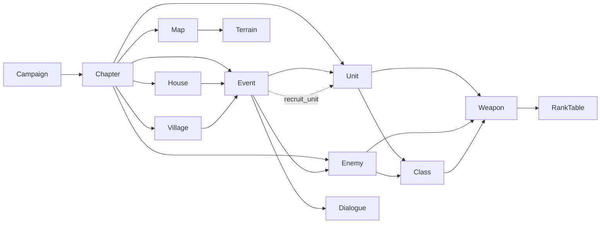

# Spécification des données et du moteur d'événements — Tactical RPG

Version du document : `1.0.0`
Statut : Référence normative pour le contenu (data-driven)

## 0. Objectif et principe fondateur

Cette spécification définit **le modèle de données complet** et **le moteur d'événements générique** permettant de créer
l'intégralité du contenu d'un tactical RPG (façon *Fire Emblem*) — classes, unités, ennemis, terrains, armes, cartes,
chapitres, dialogues, maisons, villages, recrutements, récompenses et campagnes — **sans jamais modifier le code du
moteur**. Ajouter un nouveau chapitre, une nouvelle unité ou un nouvel événement ne doit nécessiter que l'ajout ou la
modification de fichiers de contenu (JSON ou YAML), validés par des schémas.

### 0.1 Principes directeurs

1. **Tout est donnée.** Le moteur ne connaît que des schémas génériques (`Unit`, `Chapter`, `Event`, `Condition`,
   `Action`, …). Aucune règle spécifique à un chapitre ou un personnage ne doit être codée en dur.
2. **Références par identifiant stable.** Toute relation entre entités (une unité qui utilise une classe, un chapitre
   qui référence une carte, un événement qui déclenche un dialogue) passe par un **ID** textuel unique, jamais par un
   index de tableau ou une dépendance de position dans un fichier.
3. **JSON et YAML sont interchangeables.** Le moteur consomme du JSON. YAML est le format d'auteur recommandé
   (commentaires, moins verbeux) et est transpilé 1:1 en JSON au chargement (mêmes clés, mêmes types, même schéma).
   Tous les exemples de ce document sont donc valides dans les deux syntaxes ; on montre l'une ou l'autre selon le
   contexte, sans différence sémantique.
4. **Validation par schéma + validation référentielle.** Chaque type de fichier est validé par un schéma JSON
   (JSON Schema draft 2020-12) *et* par une passe de résolution de références (tous les ID cités doivent exister).
5. **Versionnement explicite.** Chaque fichier de contenu porte un champ `schemaVersion` permettant une migration
   automatique si le schéma évolue.
6. **Déterminisme.** Le moteur d'événements est piloté par des déclencheurs (*triggers*), des conditions et des
   actions, évalués dans un ordre défini et reproductible (voir §6).

---

## 1. Organisation des fichiers de contenu

```
content/
  campaign.yaml                     # 1 campagne = point d'entrée
  chapters/
    ch01_prologue.yaml
    ch02_awakening.yaml
  maps/
    ch01_valley.map.yaml            # métadonnées de carte (référence le tilemap Tiled)
    ch01_valley.tmj                 # tilemap Tiled (format standard, hors du champ du moteur)
  classes/
    classes.catalog.yaml            # catalogue des 10 classes (5 bases + 5 promotions)
  weapons/
    weapons.catalog.yaml
  terrains/
    terrains.catalog.yaml
  ranks/
    ranks.catalog.yaml
  units/
    alric.unit.yaml
    lyra.unit.yaml
  enemies/
    brigand_grunt.enemy.yaml
    dread_boss_gareth.enemy.yaml
  dialogues/
    ch01_opening.dialogue.yaml
  events/
    ch01_events.yaml                # un ou plusieurs événements par fichier
  houses/
    ch03_houses.yaml
  villages/
    ch04_villages.yaml
  schemas/                          # schémas JSON (draft 2020-12), un par type d'entité
    campaign.schema.json
    chapter.schema.json
    ...
```

Règles :

- Un fichier peut contenir **une entité** (préférable pour les unités/ennemis/cartes) ou **un catalogue** (tableau
  d'entités du même type, préférable pour classes/armes/terrains/rangs qui forment un référentiel stable).
- L'extension `.catalog.yaml` (ou `.json`) indique un tableau ; les extensions `.unit.`, `.enemy.`, `.map.`,
  `.dialogue.` indiquent une entité unique — ceci est une convention de nommage, pas une contrainte du moteur (le
  moteur détecte le contenu par le champ `kind`, voir §2.3).
- Le moteur charge **récursivement** tout `content/**/*.{yaml,yml,json}` sauf le dossier `schemas/`.

---

## 2. Conventions générales

### 2.1 Format des identifiants (ID)

Tout ID suit le motif `<namespace>:<slug>` :

- `namespace` ∈ `{class, weapon, terrain, rank, unit, enemy, map, chapter, dialogue, event, house, village, campaign,
  item}`
- `slug` : minuscules, chiffres, `_` uniquement (kebab interdit pour éviter la confusion avec les tirets de dates),
  regex : `^[a-z][a-z0-9_]*$`

Exemples : `class:myrmidon`, `weapon:iron_sword`, `terrain:forest`, `unit:alric`, `chapter:ch01_prologue`,
`dialogue:ch01_opening`, `event:ch01_turn3_reinforcement`.

Un ID est **unique dans son namespace** sur l'ensemble du projet (tous fichiers confondus). Le chargeur lève une
erreur de validation en cas de doublon.

### 2.2 Champs communs à toute entité racine

```yaml
schemaVersion: "1.0"      # obligatoire — version du schéma utilisé par ce document
kind: "unit"               # obligatoire — type d'entité, doit correspondre au schéma cible
id: "unit:alric"           # obligatoire — voir §2.1
meta:                      # optionnel — informations d'auteur, ne joue aucun rôle en jeu
  author: "design-team"
  notes: "Protagoniste principal"
  tags: ["hero", "lord"]
```

### 2.3 Détection du schéma

Le chargeur route chaque document vers son schéma de validation via le champ `kind` (et non via le chemin du
fichier) :

| `kind`        | Schéma                        | Racine attendue         |
|---------------|--------------------------------|--------------------------|
| `class`       | `class.schema.json`            | objet unique ou tableau |
| `weapon`      | `weapon.schema.json`           | objet unique ou tableau |
| `terrain`     | `terrain.schema.json`          | objet unique ou tableau |
| `rank_table`  | `rank_table.schema.json`       | objet unique             |
| `unit`        | `unit.schema.json`             | objet unique ou tableau |
| `enemy`       | `enemy.schema.json`            | objet unique ou tableau |
| `map`         | `map.schema.json`               | objet unique             |
| `chapter`     | `chapter.schema.json`          | objet unique             |
| `dialogue`    | `dialogue.schema.json`         | objet unique             |
| `event`       | `event.schema.json`             | objet unique ou tableau |
| `house`       | `house.schema.json`             | objet unique ou tableau |
| `village`     | `village.schema.json`           | objet unique ou tableau |
| `campaign`    | `campaign.schema.json`          | objet unique             |

Un fichier « catalogue » est simplement `kind` répété dans un tableau JSON/YAML de premier niveau :

```yaml
# classes/classes.catalog.yaml
- schemaVersion: "1.0"
  kind: class
  id: class:myrmidon
  ...
- schemaVersion: "1.0"
  kind: class
  id: class:swordmaster
  ...
```

### 2.4 Versionnement (`schemaVersion`)

- Format `MAJOR.MINOR` (semver simplifié, pas de PATCH côté contenu).
- **MINOR** : ajout de champs optionnels rétro-compatibles → aucune migration requise, le moteur applique des
  valeurs par défaut.
- **MAJOR** : changement de structure (renommage, suppression, changement de type) → une fonction de migration
  `migrations/<kind>/<from>-to-<to>.ts` doit exister côté moteur (ce sont des utilitaires *génériques* d'ETL de
  données, pas des règles de gameplay — ils ne violent donc pas le principe « pas de code par contenu »).
- Le moteur refuse de charger un fichier dont le `MAJOR` est supérieur à celui qu'il supporte.
- Chaque schéma JSON expose sa propre version dans `$id` (ex. `https://schemas.game/class.schema.json/v1`).

### 2.5 Validation en deux passes

1. **Validation structurelle** : chaque document est validé contre son schéma JSON (types, champs requis, enums,
   bornes numériques, formats de chaîne/regex d'ID).
2. **Validation référentielle** (post-chargement, une fois tous les fichiers lus) :
   - Tout champ `*Ref` (ex. `classRef`, `mapRef`, `weaponRef`) doit pointer vers un ID existant du bon namespace.
   - Pas de cycle dans les graphes qui ne doivent pas en avoir (ex. arbre de promotion de classes).
   - Unicité des ID (voir §2.1).
   - Cohérence des chapitres : chaque `chapter.mapRef` doit exister ; chaque unité placée doit référencer un
     `unit:` ou `enemy:` existant ; chaque événement `chapter.events[]` doit référencer un `event:` existant.
3. Le résultat de la validation (`ContentValidationReport`) liste avertissements et erreurs avec chemin JSON
   (`instancePath`) et fichier source, pour un usage en CI.

---

## 3. Catalogue : Classes

Il existe **5 classes de base** et **5 classes de promotion** (une promotion par classe de base, arbre simple
1 → 1 dans cette spécification ; une classe pourrait viser plusieurs promotions en ajoutant simplement des entrées
supplémentaires dans `promotesTo`, sans changement moteur).

### 3.1 Schéma (`class.schema.json`, résumé)

```jsonc
{
  "$id": "https://schemas.game/class.schema.json/v1",
  "type": "object",
  "required": ["schemaVersion", "kind", "id", "name", "tier", "movement", "baseStats", "growths", "weaponRanksAllowed"],
  "properties": {
    "schemaVersion": { "type": "string" },
    "kind": { "const": "class" },
    "id": { "type": "string", "pattern": "^class:[a-z][a-z0-9_]*$" },
    "name": { "type": "string" },
    "tier": { "enum": ["base", "promoted"] },
    "promotesTo": {
      "type": "array",
      "items": { "type": "string", "pattern": "^class:[a-z][a-z0-9_]*$" },
      "description": "Uniquement pour tier=base. Liste des classes de promotion possibles."
    },
    "promotionRequirements": {
      "type": "object",
      "properties": {
        "minLevel": { "type": "integer", "minimum": 1 },
        "itemRef": { "type": "string", "pattern": "^item:[a-z][a-z0-9_]*$" }
      }
    },
    "movement": { "type": "integer", "minimum": 1 },
    "movementType": { "enum": ["foot", "mounted", "flying", "armored"] },
    "baseStats": {
      "type": "object",
      "required": ["hp", "str", "mag", "skl", "spd", "lck", "def", "res", "con"],
      "additionalProperties": { "type": "integer", "minimum": 0 }
    },
    "growths": {
      "type": "object",
      "description": "Pourcentages de croissance par niveau (0-100+)",
      "additionalProperties": { "type": "integer", "minimum": 0 }
    },
    "weaponRanksAllowed": {
      "type": "array",
      "items": { "enum": ["sword", "lance", "axe", "bow", "tome_anima", "tome_light", "tome_dark", "staff"] }
    },
    "baseWeaponRanks": {
      "type": "object",
      "description": "Rang de départ par type d'arme (voir §5 Rangs)",
      "additionalProperties": { "enum": ["E", "D", "C", "B", "A", "S"] }
    }
  }
}
```

### 3.2 Exemple complet — 5 classes de base + 5 promotions

```yaml
# classes/classes.catalog.yaml
- schemaVersion: "1.0"
  kind: class
  id: class:myrmidon
  name: "Myrmidon"
  tier: base
  promotesTo: ["class:swordmaster"]
  promotionRequirements: { minLevel: 10, itemRef: item:seal_hero }
  movement: 5
  movementType: foot
  baseStats: { hp: 18, str: 4, mag: 0, skl: 8, spd: 9, lck: 4, def: 3, res: 1, con: 6 }
  growths:   { hp: 70, str: 35, mag: 0, skl: 60, spd: 65, lck: 45, def: 20, res: 15 }
  weaponRanksAllowed: ["sword"]
  baseWeaponRanks: { sword: "D" }

- schemaVersion: "1.0"
  kind: class
  id: class:swordmaster
  name: "Swordmaster"
  tier: promoted
  movement: 6
  movementType: foot
  baseStats: { hp: 24, str: 7, mag: 0, skl: 12, spd: 13, lck: 6, def: 6, res: 4, con: 7 }
  growths:   { hp: 75, str: 40, mag: 0, skl: 65, spd: 70, lck: 45, def: 25, res: 20 }
  weaponRanksAllowed: ["sword"]
  baseWeaponRanks: { sword: "C" }

- schemaVersion: "1.0"
  kind: class
  id: class:cavalier
  name: "Cavalier"
  tier: base
  promotesTo: ["class:paladin"]
  promotionRequirements: { minLevel: 10, itemRef: item:seal_knight }
  movement: 7
  movementType: mounted
  baseStats: { hp: 20, str: 7, mag: 0, skl: 5, spd: 6, lck: 4, def: 7, res: 1, con: 9 }
  growths:   { hp: 75, str: 45, mag: 0, skl: 40, spd: 40, lck: 30, def: 35, res: 10 }
  weaponRanksAllowed: ["sword", "lance"]
  baseWeaponRanks: { sword: "E", lance: "D" }

- schemaVersion: "1.0"
  kind: class
  id: class:paladin
  name: "Paladin"
  tier: promoted
  movement: 8
  movementType: mounted
  baseStats: { hp: 28, str: 10, mag: 0, skl: 8, spd: 9, lck: 6, def: 11, res: 6, con: 10 }
  growths:   { hp: 80, str: 50, mag: 0, skl: 45, spd: 45, lck: 30, def: 40, res: 20 }
  weaponRanksAllowed: ["sword", "lance"]
  baseWeaponRanks: { sword: "D", lance: "C" }

- schemaVersion: "1.0"
  kind: class
  id: class:fighter
  name: "Fighter"
  tier: base
  promotesTo: ["class:warrior"]
  promotionRequirements: { minLevel: 10, itemRef: item:seal_hero }
  movement: 5
  movementType: foot
  baseStats: { hp: 24, str: 8, mag: 0, skl: 4, spd: 5, lck: 3, def: 5, res: 0, con: 12 }
  growths:   { hp: 90, str: 55, mag: 0, skl: 35, spd: 30, lck: 25, def: 30, res: 5 }
  weaponRanksAllowed: ["axe"]
  baseWeaponRanks: { axe: "D" }

- schemaVersion: "1.0"
  kind: class
  id: class:warrior
  name: "Warrior"
  tier: promoted
  movement: 6
  movementType: foot
  baseStats: { hp: 32, str: 12, mag: 0, skl: 7, spd: 8, lck: 4, def: 9, res: 3, con: 13 }
  growths:   { hp: 95, str: 60, mag: 0, skl: 40, spd: 35, lck: 25, def: 35, res: 10 }
  weaponRanksAllowed: ["axe", "bow"]
  baseWeaponRanks: { axe: "C", bow: "D" }

- schemaVersion: "1.0"
  kind: class
  id: class:archer
  name: "Archer"
  tier: base
  promotesTo: ["class:sniper"]
  promotionRequirements: { minLevel: 10, itemRef: item:seal_hero }
  movement: 5
  movementType: foot
  baseStats: { hp: 17, str: 5, mag: 0, skl: 6, spd: 5, lck: 3, def: 3, res: 1, con: 7 }
  growths:   { hp: 65, str: 40, mag: 0, skl: 45, spd: 35, lck: 30, def: 20, res: 10 }
  weaponRanksAllowed: ["bow"]
  baseWeaponRanks: { bow: "D" }

- schemaVersion: "1.0"
  kind: class
  id: class:sniper
  name: "Sniper"
  tier: promoted
  movement: 6
  movementType: foot
  baseStats: { hp: 24, str: 8, mag: 0, skl: 10, spd: 9, lck: 5, def: 6, res: 4, con: 8 }
  growths:   { hp: 70, str: 45, mag: 0, skl: 50, spd: 40, lck: 30, def: 25, res: 15 }
  weaponRanksAllowed: ["bow"]
  baseWeaponRanks: { bow: "C" }

- schemaVersion: "1.0"
  kind: class
  id: class:mage
  name: "Mage"
  tier: base
  promotesTo: ["class:sage"]
  promotionRequirements: { minLevel: 10, itemRef: item:seal_elder }
  movement: 5
  movementType: foot
  baseStats: { hp: 16, str: 0, mag: 6, skl: 5, spd: 6, lck: 3, def: 2, res: 5, con: 4 }
  growths:   { hp: 60, str: 0, mag: 50, skl: 35, spd: 35, lck: 30, def: 10, res: 30 }
  weaponRanksAllowed: ["tome_anima"]
  baseWeaponRanks: { tome_anima: "D" }

- schemaVersion: "1.0"
  kind: class
  id: class:sage
  name: "Sage"
  tier: promoted
  movement: 6
  movementType: foot
  baseStats: { hp: 22, str: 2, mag: 10, skl: 9, spd: 10, lck: 6, def: 5, res: 10, con: 5 }
  growths:   { hp: 65, str: 5, mag: 55, skl: 40, spd: 40, lck: 30, def: 15, res: 35 }
  weaponRanksAllowed: ["tome_anima", "staff"]
  baseWeaponRanks: { tome_anima: "C", staff: "D" }
```

---

## 4. Catalogue : Terrains

### 4.1 Schéma (`terrain.schema.json`, résumé)

```jsonc
{
  "required": ["schemaVersion", "kind", "id", "name", "movementCost", "defenseBonus", "avoidBonus"],
  "properties": {
    "kind": { "const": "terrain" },
    "id": { "pattern": "^terrain:[a-z][a-z0-9_]*$" },
    "movementCost": {
      "type": "object",
      "description": "Coût de déplacement par movementType (voir §3)",
      "properties": {
        "foot": { "type": ["integer", "string"] },
        "mounted": { "type": ["integer", "string"] },
        "flying": { "type": ["integer", "string"] },
        "armored": { "type": ["integer", "string"] }
      },
      "additionalProperties": false
    },
    "defenseBonus": { "type": "integer" },
    "avoidBonus": { "type": "integer" },
    "healPercentPerTurn": { "type": "integer", "default": 0 },
    "impassable": { "type": "boolean", "default": false }
  }
}
```

`movementCost` accepte la chaîne `"impassable"` en plus d'un entier pour un type de mouvement donné (ex. une
montagne infranchissable à pied mais franchissable en vol).

### 4.2 Exemple

```yaml
# terrains/terrains.catalog.yaml
- schemaVersion: "1.0"
  kind: terrain
  id: terrain:plain
  name: "Plaine"
  movementCost: { foot: 1, mounted: 1, flying: 1, armored: 1 }
  defenseBonus: 0
  avoidBonus: 0

- schemaVersion: "1.0"
  kind: terrain
  id: terrain:forest
  name: "Forêt"
  movementCost: { foot: 2, mounted: 3, flying: 1, armored: 2 }
  defenseBonus: 1
  avoidBonus: 20

- schemaVersion: "1.0"
  kind: terrain
  id: terrain:mountain
  name: "Montagne"
  movementCost: { foot: 3, mounted: "impassable", flying: 1, armored: 4 }
  defenseBonus: 2
  avoidBonus: 30

- schemaVersion: "1.0"
  kind: terrain
  id: terrain:fort
  name: "Fort"
  movementCost: { foot: 1, mounted: 1, flying: 1, armored: 1 }
  defenseBonus: 3
  avoidBonus: 20
  healPercentPerTurn: 20

- schemaVersion: "1.0"
  kind: terrain
  id: terrain:river
  name: "Rivière"
  movementCost: { foot: 3, mounted: 4, flying: 1, armored: "impassable" }
  defenseBonus: -1
  avoidBonus: -10
```

---

## 5. Catalogue : Armes et rangs d'armes

### 5.1 Schéma Arme (`weapon.schema.json`, résumé)

```jsonc
{
  "required": ["schemaVersion", "kind", "id", "name", "type", "might", "weight", "hit", "crit", "range", "usesMax", "rankRequired"],
  "properties": {
    "kind": { "const": "weapon" },
    "id": { "pattern": "^weapon:[a-z][a-z0-9_]*$" },
    "type": { "enum": ["sword", "lance", "axe", "bow", "tome_anima", "tome_light", "tome_dark", "staff"] },
    "might": { "type": "integer" },
    "weight": { "type": "integer" },
    "hit": { "type": "integer" },
    "crit": { "type": "integer" },
    "range": {
      "type": "object",
      "required": ["min", "max"],
      "properties": { "min": { "type": "integer" }, "max": { "type": "integer" } }
    },
    "usesMax": { "type": "integer" },
    "rankRequired": { "enum": ["E", "D", "C", "B", "A", "S"] },
    "advantageOver": {
      "type": "array",
      "items": { "enum": ["sword", "lance", "axe", "bow", "tome_anima", "tome_light", "tome_dark", "staff"] },
      "description": "Triangle des armes : types sur lesquels cette arme a un bonus hit/dmg"
    },
    "staffEffect": {
      "type": "object",
      "description": "Uniquement pour type=staff",
      "properties": {
        "effect": { "enum": ["heal", "warp", "rescue", "silence", "restore", "physic"] },
        "power": { "type": "integer" }
      }
    },
    "isBrave": { "type": "boolean", "default": false },
    "effectiveAgainst": {
      "type": "array",
      "items": { "enum": ["mounted", "flying", "armored", "dragon"] }
    }
  }
}
```

Le **triangle des armes** est encodé de façon purement déclarative via `advantageOver`, ce qui permet d'ajouter de
nouveaux types d'armes (ex. un type `dagger`) sans toucher au moteur : celui-ci applique un bonus générique
(`+15 hit / +1 mt` par défaut, configurable dans `campaign.rules.weaponTriangle`, voir §11) chaque fois que
`attacker.weapon.type ∈ defender.weapon.advantageOver` est faux mais `attacker.weapon.advantageOver ∋ defender.weapon.type`.

### 5.2 Exemple d'armes

```yaml
# weapons/weapons.catalog.yaml
- schemaVersion: "1.0"
  kind: weapon
  id: weapon:iron_sword
  name: "Épée de fer"
  type: sword
  might: 5
  weight: 5
  hit: 90
  crit: 0
  range: { min: 1, max: 1 }
  usesMax: 40
  rankRequired: E
  advantageOver: ["axe"]

- schemaVersion: "1.0"
  kind: weapon
  id: weapon:iron_lance
  name: "Lance de fer"
  type: lance
  might: 7
  weight: 8
  hit: 80
  crit: 0
  range: { min: 1, max: 1 }
  usesMax: 35
  rankRequired: E
  advantageOver: ["sword"]

- schemaVersion: "1.0"
  kind: weapon
  id: weapon:iron_axe
  name: "Hache de fer"
  type: axe
  might: 8
  weight: 10
  hit: 70
  crit: 0
  range: { min: 1, max: 1 }
  usesMax: 30
  rankRequired: E
  advantageOver: ["lance"]

- schemaVersion: "1.0"
  kind: weapon
  id: weapon:iron_bow
  name: "Arc de fer"
  type: bow
  might: 6
  weight: 6
  hit: 80
  crit: 0
  range: { min: 2, max: 2 }
  usesMax: 30
  rankRequired: E
  effectiveAgainst: ["flying"]

- schemaVersion: "1.0"
  kind: weapon
  id: weapon:heal_staff
  name: "Bâton de soin"
  type: staff
  might: 0
  weight: 3
  hit: 100
  crit: 0
  range: { min: 1, max: 10 }
  usesMax: 20
  rankRequired: D
  staffEffect: { effect: heal, power: 10 }
```

### 5.3 Schéma Rangs d'armes (`rank_table.schema.json`, résumé)

Table unique et globale de seuils d'expérience par rang, réutilisée pour tous les types d'armes.

```jsonc
{
  "required": ["schemaVersion", "kind", "id", "thresholds"],
  "properties": {
    "kind": { "const": "rank_table" },
    "id": { "const": "rank_table:default" },
    "thresholds": {
      "type": "object",
      "required": ["E", "D", "C", "B", "A", "S"],
      "additionalProperties": { "type": "integer", "minimum": 0 }
    }
  }
}
```

```yaml
# ranks/ranks.catalog.yaml
schemaVersion: "1.0"
kind: rank_table
id: rank_table:default
thresholds: { E: 0, D: 31, C: 71, B: 121, A: 181, S: 251 }
```

À chaque utilisation d'arme au combat, l'unité gagne `1` point d'expérience de rang dans le type d'arme utilisé
(configurable via `campaign.rules.rankGainPerUse`). Le rang courant = plus haut seuil atteint ou dépassé.

---

## 6. Unités jouables

### 6.1 Schéma (`unit.schema.json`, résumé)

```jsonc
{
  "required": ["schemaVersion", "kind", "id", "name", "classRef", "level", "baseStats", "inventory", "affinities"],
  "properties": {
    "kind": { "const": "unit" },
    "id": { "pattern": "^unit:[a-z][a-z0-9_]*$" },
    "classRef": { "pattern": "^class:[a-z][a-z0-9_]*$" },
    "level": { "type": "integer", "minimum": 1 },
    "baseStats": { "$ref": "#/$defs/statBlock" },
    "currentWeaponRanks": {
      "type": "object",
      "additionalProperties": { "enum": ["E", "D", "C", "B", "A", "S"] }
    },
    "inventory": {
      "type": "array",
      "maxItems": 5,
      "items": {
        "type": "object",
        "required": ["itemRef"],
        "properties": { "itemRef": { "type": "string" }, "usesLeft": { "type": "integer" } }
      }
    },
    "affinities": {
      "type": "array",
      "items": { "enum": ["fire", "water", "wind", "earth", "light", "dark", "thunder"] }
    },
    "personalSkills": { "type": "array", "items": { "type": "string" } },
    "portraitRef": { "type": "string", "description": "Chemin vers l'asset portrait" },
    "unitSpriteRef": { "type": "string" },
    "isLord": { "type": "boolean", "default": false },
    "permadeath": { "enum": ["classic", "casual"], "default": "classic" }
  }
}
```

### 6.2 Exemple

```yaml
# units/alric.unit.yaml
schemaVersion: "1.0"
kind: unit
id: unit:alric
name: "Alric"
classRef: class:myrmidon
level: 1
isLord: true
baseStats: { hp: 20, str: 5, mag: 0, skl: 9, spd: 10, lck: 6, def: 4, res: 2, con: 6 }
currentWeaponRanks: { sword: "D" }
inventory:
  - itemRef: weapon:iron_sword
    usesLeft: 40
affinities: ["light"]
personalSkills: ["skill:resolve"]
portraitRef: "portraits/alric.png"
unitSpriteRef: "units/alric.json"
permadeath: classic
```

---

## 7. Ennemis

### 7.1 Schéma (`enemy.schema.json`, résumé)

Un ennemi est structurellement identique à une unité (même triplet classe/stats/inventaire) mais ajoute des
métadonnées d'IA et de butin.

```jsonc
{
  "required": ["schemaVersion", "kind", "id", "name", "classRef", "level", "baseStats", "inventory", "ai"],
  "properties": {
    "kind": { "const": "enemy" },
    "id": { "pattern": "^enemy:[a-z][a-z0-9_]*$" },
    "isBoss": { "type": "boolean", "default": false },
    "ai": {
      "type": "object",
      "required": ["behavior"],
      "properties": {
        "behavior": { "enum": ["stationary", "guard_area", "aggressive", "seek_and_destroy"] },
        "guardRadius": { "type": "integer" },
        "aggroRange": { "type": "integer" }
      }
    },
    "drops": {
      "type": "array",
      "items": {
        "type": "object",
        "required": ["itemRef", "chancePercent"],
        "properties": { "itemRef": { "type": "string" }, "chancePercent": { "type": "integer", "minimum": 0, "maximum": 100 } }
      }
    }
  }
}
```

### 7.2 Exemple

```yaml
# enemies/dread_boss_gareth.enemy.yaml
schemaVersion: "1.0"
kind: enemy
id: enemy:dread_boss_gareth
name: "Gareth le Redoutable"
classRef: class:warrior
level: 8
isBoss: true
baseStats: { hp: 40, str: 14, mag: 0, skl: 8, spd: 6, lck: 2, def: 10, res: 2, con: 14 }
inventory:
  - itemRef: weapon:iron_axe
    usesLeft: 30
ai: { behavior: guard_area, guardRadius: 3 }
drops:
  - { itemRef: item:seal_hero, chancePercent: 100 }
```

---

## 8. Cartes

### 8.1 Schéma (`map.schema.json`, résumé)

Une carte référence un tilemap externe (format Tiled `.tmj`, hors périmètre de cette spécification) et une table de
correspondance entre les identifiants de tuile Tiled et les `terrain:` de contenu.

```jsonc
{
  "required": ["schemaVersion", "kind", "id", "name", "tilemapPath", "size", "terrainLayer", "terrainMapping", "spawnPoints"],
  "properties": {
    "kind": { "const": "map" },
    "id": { "pattern": "^map:[a-z][a-z0-9_]*$" },
    "tilemapPath": { "type": "string" },
    "size": {
      "type": "object",
      "required": ["width", "height"],
      "properties": { "width": { "type": "integer" }, "height": { "type": "integer" } }
    },
    "terrainLayer": { "type": "string", "description": "Nom du calque Tiled contenant les GID de terrain" },
    "terrainMapping": {
      "type": "object",
      "description": "gid Tiled (string) -> terrain:id",
      "additionalProperties": { "type": "string", "pattern": "^terrain:[a-z][a-z0-9_]*$" }
    },
    "spawnPoints": {
      "type": "array",
      "items": {
        "type": "object",
        "required": ["id", "x", "y"],
        "properties": {
          "id": { "type": "string" },
          "x": { "type": "integer" },
          "y": { "type": "integer" }
        }
      }
    },
    "regions": {
      "type": "array",
      "description": "Zones nommées utilisées par les conditions 'arrival' (voir §10)",
      "items": {
        "type": "object",
        "required": ["id", "tiles"],
        "properties": {
          "id": { "type": "string" },
          "tiles": { "type": "array", "items": { "type": "object", "properties": { "x": { "type": "integer" }, "y": { "type": "integer" } } } }
        }
      }
    }
  }
}
```

### 8.2 Exemple

```yaml
# maps/ch01_valley.map.yaml
schemaVersion: "1.0"
kind: map
id: map:ch01_valley
name: "Vallée de Brenmoor"
tilemapPath: "maps/ch01_valley.tmj"
size: { width: 20, height: 15 }
terrainLayer: "terrain"
terrainMapping:
  "1": terrain:plain
  "2": terrain:forest
  "3": terrain:mountain
  "4": terrain:fort
  "5": terrain:river
spawnPoints:
  - { id: "player_1", x: 2, y: 12 }
  - { id: "player_2", x: 3, y: 12 }
  - { id: "enemy_boss", x: 17, y: 2 }
regions:
  - id: "north_gate"
    tiles: [{ x: 10, y: 0 }, { x: 11, y: 0 }]
  - id: "village_tile"
    tiles: [{ x: 5, y: 8 }]
```

---

## 9. Dialogues

### 9.1 Schéma (`dialogue.schema.json`, résumé)

Un dialogue est une **suite d'instructions** (commandes) interprétées séquentiellement par le moteur de dialogue,
avec support des branchements par choix et des sauts par étiquette (`label`).

```jsonc
{
  "required": ["schemaVersion", "kind", "id", "script"],
  "properties": {
    "kind": { "const": "dialogue" },
    "id": { "pattern": "^dialogue:[a-z][a-z0-9_]*$" },
    "script": {
      "type": "array",
      "items": { "$ref": "#/$defs/dialogueCommand" }
    }
  },
  "$defs": {
    "dialogueCommand": {
      "oneOf": [
        { "$ref": "#/$defs/cmdLabel" },
        { "$ref": "#/$defs/cmdSay" },
        { "$ref": "#/$defs/cmdShowPortrait" },
        { "$ref": "#/$defs/cmdHidePortrait" },
        { "$ref": "#/$defs/cmdWait" },
        { "$ref": "#/$defs/cmdChoice" },
        { "$ref": "#/$defs/cmdJump" },
        { "$ref": "#/$defs/cmdSetVar" },
        { "$ref": "#/$defs/cmdRunAction" },
        { "$ref": "#/$defs/cmdEnd" }
      ]
    }
  }
}
```

### 9.2 Commandes de dialogue

| `op`             | Champs                                                   | Effet                                                                 |
|------------------|-----------------------------------------------------------|------------------------------------------------------------------------|
| `label`          | `name`                                                    | Marque une position nommée, cible possible de `jump`.                 |
| `say`            | `speaker` (unitRef ou libellé libre), `text`, `voiceRef?` | Affiche une ligne de texte.                                            |
| `show_portrait`  | `speaker`, `emotion?`, `side` (`left`/`right`)            | Affiche un portrait.                                                   |
| `hide_portrait`  | `speaker`                                                 | Retire un portrait affiché.                                            |
| `wait`           | `ms`                                                      | Pause avant la commande suivante.                                     |
| `choice`         | `prompt`, `options[]` (`{ text, jumpTo }`)                | Affiche un choix, saute au label correspondant à l'option sélectionnée. |
| `jump`           | `to` (nom de label)                                       | Saut inconditionnel.                                                   |
| `jump_if`        | `condition` (voir §10.2), `to`                            | Saut conditionnel.                                                     |
| `set_var`        | `scope`, `key`, `op` (`set/add/sub`), `value`             | Modifie une variable (voir §10.4).                                     |
| `run_action`     | `action` (toute action du §10.3, ex. `give_item`, `recruit_unit`) | Exécute une action moteur directement depuis le dialogue. |
| `end`            | —                                                          | Termine le script.                                                     |

### 9.3 Exemple

```yaml
# dialogues/ch01_opening.dialogue.yaml
schemaVersion: "1.0"
kind: dialogue
id: dialogue:ch01_opening
script:
  - { op: show_portrait, speaker: unit:alric, emotion: "serious", side: left }
  - { op: say, speaker: unit:alric, text: "La vallée est silencieuse... trop silencieuse." }
  - { op: show_portrait, speaker: unit:lyra, emotion: "worried", side: right }
  - { op: say, speaker: unit:lyra, text: "Des brigands rôdent près du village. Restons prudents." }
  - op: choice
    prompt: "Que décidez-vous ?"
    options:
      - { text: "Avancer prudemment", jumpTo: "cautious" }
      - { text: "Charger immédiatement", jumpTo: "reckless" }
  - { op: label, name: "cautious" }
  - { op: set_var, scope: chapter, key: "opening_choice", op: set, value: "cautious" }
  - { op: jump, to: "end" }
  - { op: label, name: "reckless" }
  - { op: set_var, scope: chapter, key: "opening_choice", op: set, value: "reckless" }
  - { op: label, name: "end" }
  - { op: hide_portrait, speaker: unit:alric }
  - { op: hide_portrait, speaker: unit:lyra }
  - { op: end }
```

---

## 10. Le moteur d'événements générique

Le moteur d'événements est la pièce centrale qui permet d'implémenter **toute** la logique de chapitre sans code :
il évalue en continu une liste d'`events` définis en contenu, chacun composé d'un **déclencheur** (*trigger*), de
**conditions** et d'une liste ordonnée d'**actions**.

### 10.1 Schéma Événement (`event.schema.json`, résumé)

```jsonc
{
  "required": ["schemaVersion", "kind", "id", "trigger", "actions"],
  "properties": {
    "kind": { "const": "event" },
    "id": { "pattern": "^event:[a-z][a-z0-9_]*$" },
    "trigger": { "$ref": "#/$defs/trigger" },
    "conditions": {
      "type": "array",
      "items": { "$ref": "#/$defs/condition" },
      "description": "Combinées en ET logique par défaut (voir §10.2 pour OR/NOT explicites)"
    },
    "actions": {
      "type": "array",
      "items": { "$ref": "#/$defs/action" }
    },
    "once": { "type": "boolean", "default": true, "description": "Si vrai, l'événement ne se déclenche qu'une seule fois par partie/chapitre" },
    "priority": { "type": "integer", "default": 0, "description": "Ordre d'évaluation ; plus haut = évalué en premier à trigger égal" }
  }
}
```

### 10.2 Déclencheurs (`trigger`)

| `type`            | Payload de déclenchement                          | Description                                                                 |
|-------------------|------------------------------------------------------|-------------------------------------------------------------------------------|
| `chapter_start`   | `{}`                                                 | Se déclenche une fois à l'initialisation du chapitre (après placement des unités). |
| `turn`            | `{ phase: "player_start"\|"player_end"\|"enemy_start"\|"enemy_end", turnNumber?: int, comparator?: "eq"\|"gte"\|"lte" }` | Se déclenche à une phase de tour donnée, optionnellement filtrée par numéro de tour. |
| `boss_dead`       | `{ enemyRef: string }`                               | Se déclenche quand l'ennemi marqué `isBoss` (ou l'ID donné) meurt.            |
| `unit_dead`       | `{ unitRef: string }`                                | Se déclenche quand une unité (jouable ou ennemie) précise meurt.              |
| `arrival`         | `{ regionRef: string, faction: "player"\|"enemy"\|"any", unitRef?: string }` | Se déclenche quand une unité (ou n'importe laquelle de la faction donnée) entre dans une région de carte (voir §8, `regions`). |
| `house`           | `{ houseRef: string }`                               | Se déclenche quand une unité joueur interagit avec une maison (§12).          |
| `village`         | `{ villageRef: string }`                             | Se déclenche quand une unité joueur visite un village (§13).                  |
| `recruitment`     | `{ enemyRef: string }`                               | Se déclenche quand les conditions de recrutement d'une unité ennemie sont réunies (§14). |
| `variable_change` | `{ scope: "global"\|"campaign"\|"chapter", key: string }` | Se déclenche quand une variable change (utile pour chaîner des événements). |

Exemple de déclencheur combiné avec conditions :

```yaml
trigger: { type: turn, phase: player_start, turnNumber: 3, comparator: "eq" }
```

### 10.3 Conditions (`condition`)

Une condition est soit une **feuille** (test atomique), soit un **nœud logique** combinant des sous-conditions.

```jsonc
{
  "oneOf": [
    { "$ref": "#/$defs/conditionLeaf" },
    {
      "type": "object",
      "required": ["all"],
      "properties": { "all": { "type": "array", "items": { "$ref": "#/$defs/condition" } } }
    },
    {
      "type": "object",
      "required": ["any"],
      "properties": { "any": { "type": "array", "items": { "$ref": "#/$defs/condition" } } }
    },
    {
      "type": "object",
      "required": ["not"],
      "properties": { "not": { "$ref": "#/$defs/condition" } }
    }
  ]
}
```

Feuilles de condition disponibles (`type`) :

| `type`               | Champs                                             | Test                                                        |
|----------------------|-----------------------------------------------------|---------------------------------------------------------------|
| `var_equals`         | `scope`, `key`, `value`                             | Égalité de variable.                                          |
| `var_compare`        | `scope`, `key`, `op` (`gt/gte/lt/lte/eq/neq`), `value` | Comparaison numérique de variable.                          |
| `unit_alive`         | `unitRef`                                           | L'unité est vivante.                                          |
| `unit_dead`          | `unitRef`                                           | L'unité est morte / retirée.                                  |
| `unit_in_region`     | `unitRef`, `regionRef`                              | L'unité se trouve dans une région donnée.                     |
| `flag_set`           | `flag`                                              | Un drapeau booléen de campagne est vrai (raccourci de `var_equals` scope=campaign). |
| `chapter_objective_state` | `state` (`in_progress/won/lost`)               | État courant de l'objectif du chapitre.                        |
| `item_in_inventory`  | `unitRef`, `itemRef`                                | L'unité possède l'objet.                                       |
| `turn_number`        | `op`, `value`                                       | Comparaison directe du numéro de tour courant.                 |

Exemple :

```yaml
conditions:
  - all:
      - { type: unit_alive, unitRef: unit:alric }
      - any:
          - { type: flag_set, flag: "ch01_opening_choice_reckless" }
          - { type: turn_number, op: gte, value: 5 }
```

### 10.4 Variables (`scope`)

| `scope`     | Portée / persistance                                                                 |
|-------------|-----------------------------------------------------------------------------------------|
| `chapter`   | Réinitialisée à chaque entrée dans le chapitre. Utilisée pour l'état local (ex. choix de dialogue, compteurs de vagues). |
| `campaign`  | Persistante sur toute la sauvegarde (ex. relations, unités recrutées, choix majeurs).   |
| `global`    | Persistante entre campagnes / profils (ex. options de New Game+, statistiques méta).    |

Les variables sont typées librement (booléen, entier, chaîne) et créées à la première écriture (`set_var`/`set_variable`
action). Aucune déclaration préalable n'est requise, mais il est recommandé de documenter les variables utilisées
par chapitre dans `chapter.variables` (voir §15) à des fins de lisibilité et de validation.

### 10.5 Actions (`action`)

```jsonc
{
  "required": ["type"],
  "oneOf": [
    { "$ref": "#/$defs/actionShowDialogue" },
    { "$ref": "#/$defs/actionSpawnUnit" },
    { "$ref": "#/$defs/actionRemoveUnit" },
    { "$ref": "#/$defs/actionMoveUnit" },
    { "$ref": "#/$defs/actionGiveItem" },
    { "$ref": "#/$defs/actionGiveGold" },
    { "$ref": "#/$defs/actionGiveExperience" },
    { "$ref": "#/$defs/actionSetVariable" },
    { "$ref": "#/$defs/actionRecruitUnit" },
    { "$ref": "#/$defs/actionEndChapter" },
    { "$ref": "#/$defs/actionCameraFocus" },
    { "$ref": "#/$defs/actionFadeScreen" },
    { "$ref": "#/$defs/actionPlaySound" },
    { "$ref": "#/$defs/actionTriggerEvent" }
  ]
}
```

| `type`               | Champs principaux                                                | Effet                                                                 |
|----------------------|---------------------------------------------------------------------|--------------------------------------------------------------------|
| `show_dialogue`       | `dialogueRef`                                                     | Lance un script de dialogue (§9).                                    |
| `spawn_unit`          | `entityRef` (`unit:` ou `enemy:`), `spawnPointId` ou `{x,y}`, `factionOverride?` | Fait apparaître une unité (renforts).                       |
| `remove_unit`         | `unitRef`                                                          | Retire une unité de la carte (ex. fuite d'un boss).                  |
| `move_unit`           | `unitRef`, `to` (`{x,y}` ou `spawnPointId`), `instant` (bool)      | Déplace une unité (scripté, hors combat).                             |
| `give_item`           | `unitRef`, `itemRef`, `quantity?`                                   | Ajoute un objet à l'inventaire.                                       |
| `give_gold`           | `amount`                                                           | Ajoute de l'or à la trésorerie de campagne.                          |
| `give_experience`     | `unitRef`, `amount`                                                | Ajoute de l'expérience.                                               |
| `set_variable`        | `scope`, `key`, `op` (`set/add/sub/toggle`), `value?`               | Modifie une variable (§10.4).                                         |
| `recruit_unit`        | `enemyRef`, `becomesUnitRef`                                        | Convertit une unité ennemie en unité jouable (§14).                   |
| `end_chapter`          | `result` (`victory`/`defeat`), `nextChapterRef?`                    | Termine le chapitre et enchaîne (§15).                                |
| `camera_focus`         | `target` (`{x,y}` ou `unitRef`), `durationMs`                      | Déplace la caméra pour mettre en scène un événement.                  |
| `fade_screen`          | `mode` (`in`/`out`), `durationMs`, `color?`                          | Fondu d'écran (transitions cinématiques).                             |
| `play_sound`           | `soundRef`, `volume?`                                              | Joue un effet sonore ou une musique.                                  |
| `trigger_event`        | `eventRef`                                                          | Force l'exécution immédiate d'un autre événement (chaînage explicite). |

### 10.6 Récompenses — modèle générique

Les actions `give_item`, `give_gold`, `give_experience` sont volontairement atomiques et composables ; une
« récompense de chapitre » est donc simplement une **liste d'actions** exécutée par l'action `end_chapter` (voir
l'exemple §16) ou par un événement dédié `event:chXX_rewards` déclenché sur `chapter_start` du chapitre suivant, au
choix du concepteur. Aucune notion de « récompense » n'existe en dur dans le moteur : c'est une composition de
primitives.

### 10.7 Ordre d'évaluation

1. À chaque **frame logique** (tick de simulation, pas la frame de rendu), le moteur collecte les événements dont le
   `trigger` correspond à un fait survenu depuis le dernier tick (mort d'unité, changement de phase, entrée en
   région, etc.).
2. Les événements candidats sont triés par `priority` décroissante, puis par ordre de déclaration dans les fichiers
   (ordre stable / *stable sort*).
3. Pour chaque événement, si `conditions` est vide ou évalue à vrai, les `actions` sont exécutées **séquentiellement
   et de façon synchrone du point de vue du moteur d'événements** (une action bloquante comme `show_dialogue`
   suspend l'exécution des actions suivantes du même événement jusqu'à sa résolution, mais ne bloque pas les autres
   systèmes du jeu comme le rendu).
4. Si `once: true` (défaut), l'événement est marqué comme consommé dans `chapter` (variable interne
   `__event_fired.<id>`) et ne sera plus réévalué pour la durée du chapitre.
5. Une action peut elle-même déclencher un autre événement via `trigger_event` ou via un changement de variable
   observé par un événement à déclencheur `variable_change` — dans ce cas le nouvel événement est empilé et traité
   avant de reprendre la file en cours (traitement en pile, profondeur maximale configurable, défaut 8, pour éviter
   les boucles infinies accidentelles).

---

## 11. Campagnes

### 11.1 Schéma (`campaign.schema.json`, résumé)

```jsonc
{
  "required": ["schemaVersion", "kind", "id", "name", "startingChapterRef", "chapters", "initialRoster"],
  "properties": {
    "kind": { "const": "campaign" },
    "id": { "pattern": "^campaign:[a-z][a-z0-9_]*$" },
    "startingChapterRef": { "pattern": "^chapter:[a-z][a-z0-9_]*$" },
    "chapters": {
      "type": "array",
      "description": "Ordre canonique d'enchaînement, utilisé par défaut si un chapitre ne fixe pas explicitement nextChapterRef",
      "items": { "type": "string", "pattern": "^chapter:[a-z][a-z0-9_]*$" }
    },
    "initialRoster": {
      "type": "array",
      "items": { "type": "string", "pattern": "^unit:[a-z][a-z0-9_]*$" }
    },
    "rules": {
      "type": "object",
      "properties": {
        "weaponTriangleBonusHit": { "type": "integer", "default": 15 },
        "weaponTriangleBonusMight": { "type": "integer", "default": 1 },
        "rankGainPerUse": { "type": "integer", "default": 1 },
        "permadeath": { "enum": ["classic", "casual"], "default": "classic" }
      }
    }
  }
}
```

### 11.2 Exemple

```yaml
# campaign.yaml
schemaVersion: "1.0"
kind: campaign
id: campaign:main_campaign
name: "Les Chroniques de Brenmoor"
startingChapterRef: chapter:ch01_prologue
chapters:
  - chapter:ch01_prologue
  - chapter:ch02_awakening
initialRoster: [unit:alric, unit:lyra]
rules:
  weaponTriangleBonusHit: 15
  weaponTriangleBonusMight: 1
  rankGainPerUse: 1
  permadeath: classic
```

---

## 12. Maisons

Les maisons sont des points d'interaction ponctuels (généralement une visite unique) qui délivrent un dialogue et/ou
une récompense simple, sans logique de recrutement.

### 12.1 Schéma (`house.schema.json`, résumé)

```jsonc
{
  "required": ["schemaVersion", "kind", "id", "mapRef", "tile", "onVisitEventRef"],
  "properties": {
    "kind": { "const": "house" },
    "id": { "pattern": "^house:[a-z][a-z0-9_]*$" },
    "mapRef": { "pattern": "^map:[a-z][a-z0-9_]*$" },
    "tile": { "type": "object", "properties": { "x": { "type": "integer" }, "y": { "type": "integer" } } },
    "onVisitEventRef": { "pattern": "^event:[a-z][a-z0-9_]*$" },
    "visitedOnce": { "type": "boolean", "default": true },
    "canBeBurned": { "type": "boolean", "default": true }
  }
}
```

Le trigger `house` (§10.2) est émis quand une unité joueur atteint la tuile `tile` de la maison ; l'événement pointé
par `onVisitEventRef` (ou tout événement dont le `trigger.type = house` et `houseRef` correspond) gère le contenu.

### 12.2 Exemple

```yaml
# houses/ch03_houses.yaml
- schemaVersion: "1.0"
  kind: house
  id: house:ch03_house_1
  mapRef: map:ch03_hamlet
  tile: { x: 6, y: 4 }
  onVisitEventRef: event:ch03_house_1_visited
  visitedOnce: true
```

```yaml
# events/ch03_events.yaml
- schemaVersion: "1.0"
  kind: event
  id: event:ch03_house_1_visited
  trigger: { type: house, houseRef: house:ch03_house_1 }
  actions:
    - { type: show_dialogue, dialogueRef: dialogue:ch03_house_1 }
    - { type: give_gold, amount: 500 }
```

---

## 13. Villages

Les villages sont structurellement proches des maisons mais offrent en plus un choix courant entre objet, or ou
recrutement, et peuvent être « perdus » (détruits par l'ennemi) — d'où le champ `atRiskEventRef`.

### 13.1 Schéma (`village.schema.json`, résumé)

```jsonc
{
  "required": ["schemaVersion", "kind", "id", "mapRef", "tile", "onVisitEventRef"],
  "properties": {
    "kind": { "const": "village" },
    "id": { "pattern": "^village:[a-z][a-z0-9_]*$" },
    "mapRef": { "pattern": "^map:[a-z][a-z0-9_]*$" },
    "tile": { "type": "object", "properties": { "x": { "type": "integer" }, "y": { "type": "integer" } } },
    "onVisitEventRef": { "pattern": "^event:[a-z][a-z0-9_]*$" },
    "atRiskEventRef": { "pattern": "^event:[a-z][a-z0-9_]*$", "description": "Optionnel — déclenché si un ennemi atteint la tuile avant le joueur" },
    "visitedOnce": { "type": "boolean", "default": true }
  }
}
```

### 13.2 Exemple

```yaml
# villages/ch04_villages.yaml
- schemaVersion: "1.0"
  kind: village
  id: village:ch04_armory
  mapRef: map:ch04_field
  tile: { x: 5, y: 8 }
  onVisitEventRef: event:ch04_village_visited
  atRiskEventRef: event:ch04_village_burned
```

```yaml
# events/ch04_events.yaml
- schemaVersion: "1.0"
  kind: event
  id: event:ch04_village_visited
  trigger: { type: village, villageRef: village:ch04_armory }
  actions:
    - { type: show_dialogue, dialogueRef: dialogue:ch04_village_armory }
    - { type: give_item, unitRef: unit:alric, itemRef: weapon:iron_lance }

- schemaVersion: "1.0"
  kind: event
  id: event:ch04_village_burned
  trigger: { type: arrival, regionRef: "village_tile", faction: enemy }
  conditions:
    - { type: flag_set, flag: "ch04_village_armory_visited" , not: true }
  actions:
    - { type: set_variable, scope: chapter, key: "village_armory_lost", op: set, value: true }
    - { type: play_sound, soundRef: "sfx/village_burn.ogg" }
```

---

## 14. Recrutement

Le recrutement est modélisé comme un **événement** au déclencheur `recruitment`, dont les conditions déterminent
l'éligibilité (ex. tel personnage adjacent, tel objet en inventaire, tour ≤ N) et dont l'action `recruit_unit`
effectue la conversion.

### 14.1 Déclencheur et action

```yaml
trigger: { type: recruitment, enemyRef: enemy:mercenary_kaine }
conditions:
  - { type: unit_in_region, unitRef: unit:lyra, regionRef: "kaine_adjacent_zone" }
actions:
  - { type: show_dialogue, dialogueRef: dialogue:ch05_kaine_recruit }
  - { type: recruit_unit, enemyRef: enemy:mercenary_kaine, becomesUnitRef: unit:kaine }
```

`recruit_unit` retire l'entité `enemy:` de la simulation de combat ennemie et instancie l'unité jouable
`unit:kaine` (déclarée séparément comme une unité normale, §6) à l'emplacement courant de l'ennemi recruté, sans
perte de tour.

### 14.2 Exemple complet

```yaml
# events/ch05_events.yaml
- schemaVersion: "1.0"
  kind: event
  id: event:ch05_recruit_kaine
  trigger: { type: recruitment, enemyRef: enemy:mercenary_kaine }
  conditions:
    - all:
        - { type: unit_alive, unitRef: unit:lyra }
        - { type: unit_in_region, unitRef: unit:lyra, regionRef: "kaine_adjacent_zone" }
  actions:
    - { type: show_dialogue, dialogueRef: dialogue:ch05_kaine_recruit }
    - { type: recruit_unit, enemyRef: enemy:mercenary_kaine, becomesUnitRef: unit:kaine }
    - { type: set_variable, scope: campaign, key: "kaine_recruited", op: set, value: true }
```

---

## 15. Chapitres

### 15.1 Schéma (`chapter.schema.json`, résumé)

```jsonc
{
  "required": ["schemaVersion", "kind", "id", "name", "mapRef", "objective", "playerUnits", "enemyUnits", "events"],
  "properties": {
    "kind": { "const": "chapter" },
    "id": { "pattern": "^chapter:[a-z][a-z0-9_]*$" },
    "mapRef": { "pattern": "^map:[a-z][a-z0-9_]*$" },
    "nextChapterRef": { "pattern": "^chapter:[a-z][a-z0-9_]*$" },
    "objective": {
      "type": "object",
      "required": ["type"],
      "properties": {
        "type": { "enum": ["rout", "seize", "defend", "survive_turns", "boss_kill", "escape"] },
        "targetTile": { "type": "object" },
        "turnsToSurvive": { "type": "integer" },
        "bossRef": { "type": "string" }
      }
    },
    "playerUnits": {
      "type": "array",
      "items": {
        "type": "object",
        "required": ["unitRef", "spawnPointId"],
        "properties": { "unitRef": { "type": "string" }, "spawnPointId": { "type": "string" }, "required": { "type": "boolean", "default": false } }
      }
    },
    "enemyUnits": {
      "type": "array",
      "items": {
        "type": "object",
        "required": ["enemyRef", "spawnPointId"],
        "properties": { "enemyRef": { "type": "string" }, "spawnPointId": { "type": "string" } }
      }
    },
    "events": {
      "type": "array",
      "items": { "type": "string", "pattern": "^event:[a-z][a-z0-9_]*$" },
      "description": "Sous-ensemble d'events actifs pour ce chapitre (les autres events du dépôt sont ignorés)"
    },
    "houses": { "type": "array", "items": { "type": "string", "pattern": "^house:[a-z][a-z0-9_]*$" } },
    "villages": { "type": "array", "items": { "type": "string", "pattern": "^village:[a-z][a-z0-9_]*$" } },
    "variables": {
      "type": "object",
      "description": "Documentation/valeurs initiales des variables de portée 'chapter' (facultatif, purement informatif + valeurs par défaut)"
    }
  }
}
```

### 15.2 Chargement d'un chapitre — pipeline

1. Résolution de `mapRef` → chargement du tilemap et application de `terrainMapping`.
2. Instanciation des `playerUnits` (fusion du roster de campagne courant + overrides de placement) et des
   `enemyUnits` aux `spawnPointId` indiqués.
3. Initialisation des variables `chapter.variables` avec leurs valeurs par défaut.
4. Activation exclusive des `events` listés dans le chapitre (les événements d'autres fichiers ne sont pas actifs
   tant que le chapitre ne les référence pas — évite les collisions inter-chapitres).
5. Déclenchement du trigger `chapter_start` (voir §10.7).
6. Boucle de jeu normale (tours joueur/ennemi) avec évaluation continue des événements actifs.
7. Fin de chapitre sur `end_chapter` (action) ou détection automatique de la condition de victoire/défaite de
   `objective` → transition vers `nextChapterRef` ou `campaign.chapters[n+1]`.

---

## 16. Exemple complet de chapitre

L'exemple ci-dessous relie tous les concepts précédents : carte, unités, ennemis, maison, village, dialogues,
recrutement, renfort au tour 3, mort du boss, et récompenses de fin de chapitre.

```yaml
# chapters/ch01_prologue.yaml
schemaVersion: "1.0"
kind: chapter
id: chapter:ch01_prologue
name: "Prologue — La Vallée de Brenmoor"
mapRef: map:ch01_valley
nextChapterRef: chapter:ch02_awakening
objective: { type: boss_kill, bossRef: enemy:dread_boss_gareth }
playerUnits:
  - { unitRef: unit:alric, spawnPointId: "player_1", required: true }
  - { unitRef: unit:lyra, spawnPointId: "player_2" }
enemyUnits:
  - { enemyRef: enemy:brigand_grunt, spawnPointId: "enemy_1" }
  - { enemyRef: enemy:dread_boss_gareth, spawnPointId: "enemy_boss" }
houses:
  - house:ch01_house_1
villages:
  - village:ch01_village_1
events:
  - event:ch01_chapter_intro
  - event:ch01_turn3_reinforcement
  - event:ch01_boss_defeated
  - event:ch01_house_1_visited
  - event:ch01_village_1_visited
variables:
  reinforcement_spawned: false
```

```yaml
# events/ch01_events.yaml
- schemaVersion: "1.0"
  kind: event
  id: event:ch01_chapter_intro
  trigger: { type: chapter_start }
  actions:
    - { type: fade_screen, mode: in, durationMs: 500 }
    - { type: show_dialogue, dialogueRef: dialogue:ch01_opening }

- schemaVersion: "1.0"
  kind: event
  id: event:ch01_turn3_reinforcement
  trigger: { type: turn, phase: enemy_start, turnNumber: 3, comparator: "gte" }
  conditions:
    - { type: var_equals, scope: chapter, key: "reinforcement_spawned", value: false }
  actions:
    - { type: spawn_unit, entityRef: enemy:brigand_grunt, spawnPointId: "enemy_reinforcement_1" }
    - { type: spawn_unit, entityRef: enemy:brigand_grunt, spawnPointId: "enemy_reinforcement_2" }
    - { type: set_variable, scope: chapter, key: "reinforcement_spawned", op: set, value: true }

- schemaVersion: "1.0"
  kind: event
  id: event:ch01_boss_defeated
  trigger: { type: boss_dead, enemyRef: enemy:dread_boss_gareth }
  actions:
    - { type: show_dialogue, dialogueRef: dialogue:ch01_boss_defeated }
    - { type: give_gold, amount: 1000 }
    - { type: give_experience, unitRef: unit:alric, amount: 20 }
    - { type: end_chapter, result: victory, nextChapterRef: chapter:ch02_awakening }

- schemaVersion: "1.0"
  kind: event
  id: event:ch01_house_1_visited
  trigger: { type: house, houseRef: house:ch01_house_1 }
  actions:
    - { type: show_dialogue, dialogueRef: dialogue:ch01_house_1 }
    - { type: give_item, unitRef: unit:alric, itemRef: item:vulnerary }

- schemaVersion: "1.0"
  kind: event
  id: event:ch01_village_1_visited
  trigger: { type: village, villageRef: village:ch01_village_1 }
  actions:
    - { type: show_dialogue, dialogueRef: dialogue:ch01_village_1 }
    - { type: give_gold, amount: 300 }
```

```yaml
# houses/ch01_houses.yaml
- schemaVersion: "1.0"
  kind: house
  id: house:ch01_house_1
  mapRef: map:ch01_valley
  tile: { x: 4, y: 10 }
  onVisitEventRef: event:ch01_house_1_visited
```

```yaml
# villages/ch01_villages.yaml
- schemaVersion: "1.0"
  kind: village
  id: village:ch01_village_1
  mapRef: map:ch01_valley
  tile: { x: 5, y: 8 }
  onVisitEventRef: event:ch01_village_1_visited
```

Ce chapitre est **entièrement défini par le contenu** : ajouter un chapitre `ch06` supplémentaire ne requiert que la
création de fichiers analogues (`chapters/ch06_*.yaml`, `maps/ch06_*.map.yaml`, `events/ch06_events.yaml`,
`dialogues/ch06_*.dialogue.yaml`, éventuellement `houses/`, `villages/`), sans toucher au moteur.

---

## 17. Chargement, cache et rechargement à chaud

1. **Découverte** : scan récursif de `content/**/*.{yaml,yml,json}` (hors `schemas/`).
2. **Parsing** : YAML → JSON (bibliothèque standard, ex. `yaml`), JSON → objet natif.
3. **Normalisation** : les fichiers « catalogue » (tableaux) sont éclatés en documents individuels ; chaque document
   se voit attribuer sa provenance (`sourceFile`) pour les messages d'erreur.
4. **Validation structurelle** par `kind` (§2.5.1) via un valideur JSON Schema (ex. Ajv), un schéma par `kind`.
5. **Indexation** : construction d'une table `Map<id, entity>` par namespace ; détection des doublons d'ID.
6. **Validation référentielle** (§2.5.2) sur l'ensemble indexé.
7. **Rapport** : `ContentValidationReport { errors: [], warnings: [] }` — en cas d'erreur bloquante, le chargement
   échoue explicitement (fail-fast) plutôt que de démarrer avec du contenu invalide.
8. **Rechargement à chaud (dev only)** : en environnement de développement, un observateur de fichiers réexécute les
   étapes 1 à 7 sur modification et republie l'index si la validation réussit ; en cas d'échec, l'ancien index reste
   actif et l'erreur est journalisée (le jeu en cours n'est jamais interrompu par un contenu invalide).

---

## 18. Résumé des schémas et de leurs relations



---

## 19. Check-list d'ajout de contenu (sans code moteur)

Pour ajouter un nouveau chapitre complet, un concepteur de contenu doit uniquement :

1. Créer la carte (`maps/*.map.yaml` + tilemap `.tmj`).
2. Déclarer les nouvelles unités/ennemis si besoin (`units/*.unit.yaml`, `enemies/*.enemy.yaml`), en réutilisant les
   classes, armes et terrains existants (ou en les étendant via les catalogues §3-§5).
3. Écrire les dialogues (`dialogues/*.dialogue.yaml`).
4. Déclarer les maisons/villages éventuels (`houses/*.yaml`, `villages/*.yaml`).
5. Écrire les événements (`events/*.yaml`) couvrant `chapter_start`, objectifs spéciaux, renforts, mort de boss,
   recrutement, visites.
6. Écrire le chapitre (`chapters/*.yaml`) référençant tout ce qui précède par ID.
7. Ajouter l'ID du chapitre à `campaign.yaml`.
8. Lancer la validation de contenu (§17) et corriger les erreurs de schéma/référence avant de tester en jeu.

Aucune de ces étapes ne modifie le moteur : elles ajoutent uniquement des documents JSON/YAML validés par les
schémas définis dans cette spécification.
