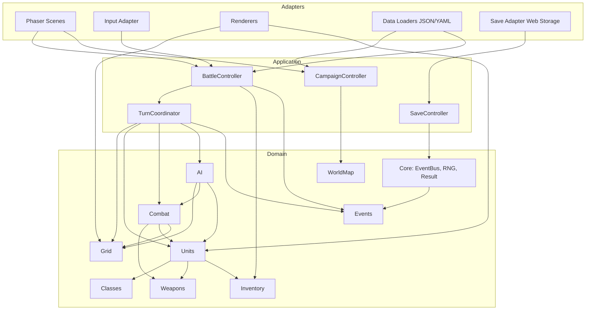
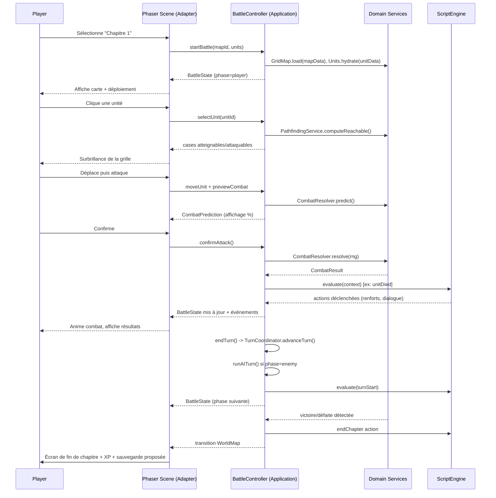

# Document de Conception Technique — Tactical RPG Data-Driven

> Statut : proposition d'architecture. Aucun code moteur n'existe encore dans ce dépôt (template Phaser 4 / Vite / TypeScript vierge). Ce document définit l'architecture cible avant implémentation.

## 1. Objectifs et contraintes

- **Genre** : Tactical RPG au tour par tour sur grille (façon Fire Emblem / Tactics Ogre).
- **Stack** : TypeScript strict, Phaser 4, Vite, sans framework UI additionnel imposé.
- **Data-driven** : classes, unités, armes, ennemis, cartes, dialogues, IA et progression doivent être définis en **JSON/YAML** externes, chargés au runtime, **sans jamais recompiler le moteur**.
- **Modularité** : chaque module a une frontière claire (responsabilités, données, API publique, dépendances explicites) pour permettre le développement, le test et le remplacement indépendants.
- **Testabilité** : la logique de jeu (règles, combat, IA, pathfinding) doit être testable unitairement sans instancier Phaser (pas de dépendance directe au rendu).
- **Extensibilité** : ajouter une classe, une arme, un type de terrain ou un comportement d'IA ne doit nécessiter que l'ajout de données et, au pire, un petit plugin — jamais une modification du cœur.

## 2. Principes d'architecture

### 2.1 Séparation Domaine / Application / Adapters (architecture hexagonale allégée)

```
┌─────────────────────────────────────────────────────────────────┐
│                         ADAPTERS (I/O)                          │
│  Phaser Scenes, Input, Rendering, Audio, FileSystem/HTTP loaders │
│  ─────────────────────────────────────────────────────────────  │
│                      APPLICATION (orchestration)                │
│   Use-cases : DemarrerChapitre, JouerTourIA, ResoudreCombat,     │
│   SauvegarderPartie, SelectionnerUnite...                        │
│  ─────────────────────────────────────────────────────────────  │
│                     DOMAINE (règles pures, aucune dépendance)    │
│   Entités : Unit, Weapon, Class, Grid, Tile, Battle, Inventory   │
│   Services : PathfindingService, CombatResolver, AIStrategy      │
└─────────────────────────────────────────────────────────────────┘
```

Règles :

1. **Domaine** : TypeScript pur, zéro import Phaser, zéro I/O. Fonctions déterministes et testables (Jest/Vitest en Node).
2. **Application** : orchestre les cas d'usage domaine, gère l'état de la partie (state machine de tour), ne connaît pas Phaser directement (interfaces uniquement).
3** Adapters** : implémentent les interfaces définies par le domaine/application — Scenes Phaser, chargeurs JSON/YAML, input clavier/manette/souris, rendu, persistance (localStorage/IndexedDB/fichier).

Cette séparation permet de remplacer Phaser par un autre moteur de rendu (ou un runner headless pour les tests d'IA/équilibrage) sans toucher aux règles du jeu.

### 2.2 Flux de dépendance

Le domaine ne dépend de rien. L'application dépend du domaine. Les adapters dépendent de l'application et du domaine. Jamais l'inverse (règle de dépendance de Clean Architecture).

```
adapters/phaser  →  application  →  domain
adapters/loaders →  application  →  domain
adapters/save    →  application  →  domain
```

### 2.3 Arborescence proposée

```
src/
  domain/
    core/
    grid/
    units/
    classes/
    weapons/
    combat/
    ai/
    inventory/
    worldmap/
    events/
  application/
    battle/            (orchestration d'un combat)
    campaign/           (progression, worldmap, chapitres)
    save/
  adapters/
    phaser/
      scenes/
      renderers/
      input/
    data/
      loaders/          (JSON/YAML → objets validés)
      schemas/           (schémas de validation, ex: zod)
    persistence/
      web-storage/
  game/                 (bootstrap Phaser existant, config, main.ts)
data/                   (fichiers JSON/YAML data-driven, hors src/)
  classes/
  units/
  weapons/
  maps/
  ai-profiles/
  dialogues/
test/
  domain/
  application/
```

> `data/` est servi en asset statique par Vite (dossier `public/data` ou `src/assets/data` selon convention du template) afin d’être chargé par fetch/import au runtime, garantissant qu’aucune donnée de gameplay n’est compilée en dur dans le bundle logique.

---

## 3. Schéma d'architecture globale



---

## 4. Modules du domaine

Chaque module suit le même canevas : **Responsabilités**, **Données (schéma)**, **Interfaces publiques**, **Dépendances**.

### 4.1 Core

**Responsabilités**
- Fournir les primitives partagées : `EventBus` typé, générateur aléatoire déterministe (`RNGService`, seedable pour la reproductibilité des replays/tests), type `Result<T, E>` pour la gestion d'erreurs sans exceptions, identifiants (`EntityId`), horloge logique de partie.
- Ne contient **aucune règle de gameplay**.

**Données**
- Aucune donnée externe propre ; consomme une seed RNG (`number | string`) provenant de la sauvegarde ou d'une nouvelle partie.

**Interfaces publiques**

```typescript
// domain/core/event-bus.ts
export interface GameEventMap {
  "unit:moved": { unitId: string; from: Coord; to: Coord };
  "unit:died": { unitId: string };
  "combat:resolved": { result: CombatResult };
  "turn:started": { faction: FactionId; turnNumber: number };
  "turn:ended": { faction: FactionId; turnNumber: number };
  // extensible via déclaration de module (voir §11 extensibilité)
}

export interface EventBus {
  on<K extends keyof GameEventMap>(event: K, handler: (payload: GameEventMap[K]) => void): () => void; // retourne unsubscribe
  emit<K extends keyof GameEventMap>(event: K, payload: GameEventMap[K]): void;
}

// domain/core/rng.ts
export interface RNGService {
  readonly seed: string;
  nextFloat(): number;          // [0,1)
  nextInt(min: number, max: number): number;
  chance(probabilityPercent: number): boolean;
  fork(label: string): RNGService; // sous-flux déterministe par contexte (ex: "combat", "ai")
}

// domain/core/result.ts
export type Result<T, E = DomainError> =
  | { ok: true; value: T }
  | { ok: false; error: E };

export interface DomainError {
  code: string;
  message: string;
  context?: Record<string, unknown>;
}
```

**Dépendances** : aucune (module racine).

---

### 4.2 Grid

**Responsabilités**
- Modéliser la carte tactique : dimensions, tuiles, coûts de déplacement, occupation, ligne de vue (LOS), zones d'effet (ZoC), calcul de plage de mouvement/attaque, **pathfinding**.
- Indépendant du rendu (pas de coordonnées pixel, uniquement des coordonnées logiques `{ x, y }`).

**Données** (`data/maps/<chapitre>.json`)

```json
{
  "id": "chapter-01",
  "width": 20,
  "height": 15,
  "tileset": "plains",
  "tiles": [
    { "x": 0, "y": 0, "terrain": "plain" },
    { "x": 1, "y": 0, "terrain": "forest" },
    { "x": 2, "y": 0, "terrain": "wall", "blocksLOS": true }
  ],
  "spawnPoints": [
    { "faction": "player", "x": 2, "y": 12, "slot": 0 },
    { "faction": "enemy", "x": 17, "y": 2, "slot": 0 }
  ]
}
```

`data/terrains.json` (catalogue réutilisable entre cartes) :

```json
{
  "plain":  { "moveCost": 1, "defenseBonus": 0, "avoidBonus": 0, "blocksLOS": false, "impassable": false },
  "forest": { "moveCost": 2, "defenseBonus": 1, "avoidBonus": 20, "blocksLOS": false, "impassable": false },
  "wall":   { "moveCost": 99, "defenseBonus": 0, "avoidBonus": 0, "blocksLOS": true, "impassable": true },
  "water":  { "moveCost": 3, "defenseBonus": -1, "avoidBonus": -10, "blocksLOS": false, "impassable": false }
}
```

**Interfaces publiques**

```typescript
export interface Coord { x: number; y: number }

export interface TerrainDef {
  id: string;
  moveCost: number;
  defenseBonus: number;
  avoidBonus: number;
  blocksLOS: boolean;
  impassable: boolean;
}

export interface Tile {
  coord: Coord;
  terrain: TerrainDef;
  occupantId?: string;
}

export interface GridMap {
  readonly id: string;
  readonly width: number;
  readonly height: number;
  getTile(c: Coord): Tile | undefined;
  isInBounds(c: Coord): boolean;
  isOccupied(c: Coord): boolean;
  setOccupant(c: Coord, unitId: string | undefined): void;
  neighbors(c: Coord): Coord[];
}

export interface PathfindingService {
  /** Coût de déplacement (Dijkstra/A*) borné par movementRange, retourne toutes les cases atteignables. */
  computeReachable(grid: GridMap, from: Coord, movementRange: number, opts?: PathOptions): ReachableMap;
  /** Chemin le plus court entre deux cases (A*), utilisé pour l'animation de déplacement et l'IA. */
  findPath(grid: GridMap, from: Coord, to: Coord, opts?: PathOptions): Coord[] | undefined;
  /** Cases attaquables depuis une position donnée (portée d'arme min/max). */
  computeAttackRange(grid: GridMap, from: Coord, minRange: number, maxRange: number): Coord[];
  hasLineOfSight(grid: GridMap, from: Coord, to: Coord): boolean;
}

export interface PathOptions {
  allowedTerrainFilter?: (t: TerrainDef) => boolean;
  blockedBy?: (c: Coord) => boolean; // ex: unités ennemies bloquent la traversée mais pas l'arrêt
}

export type ReachableMap = Map<string /* "x,y" */, { coord: Coord; cost: number; path: Coord[] }>;
```

**Dépendances** : Core (types `Coord` peuvent vivre ici, `Result` pour erreurs de carte invalide).

---

### 4.3 Units

**Responsabilités**
- Représenter une unité (joueur, ennemi, PNJ) : statistiques dérivées (classe + niveau + équipement + croissance), points de vie, statuts (poison, gel...), position logique, faction.
- Calculer les statistiques effectives (agrégation classe/niveau/objets/altérations).

**Données** (`data/units/<unit-id>.json`)

```json
{
  "id": "unit.marth",
  "name": "Marth",
  "classId": "class.lord",
  "level": 5,
  "faction": "player",
  "baseStats": { "hp": 22, "str": 8, "mag": 1, "skl": 9, "spd": 10, "lck": 7, "def": 6, "res": 2, "mov": 5 },
  "growths": { "hp": 80, "str": 45, "mag": 20, "skl": 45, "spd": 40, "lck": 45, "def": 25, "res": 15 },
  "inventory": ["item.rapier", "item.vulnerary"],
  "affinities": ["light"],
  "aiProfileId": null
}
```

**Interfaces publiques**

```typescript
export interface StatBlock {
  hp: number; str: number; mag: number; skl: number;
  spd: number; lck: number; def: number; res: number; mov: number;
}

export interface UnitState {
  readonly id: string;
  readonly name: string;
  readonly faction: FactionId;
  classId: string;
  level: number;
  experience: number;
  currentHP: number;
  position: Coord;
  statuses: StatusEffect[];
  equippedWeaponId?: string;
  inventory: InventorySlot[]; // voir module Inventory
  hasActedThisTurn: boolean;
  hasMovedThisTurn: boolean;
}

export interface StatusEffect {
  id: string;         // "poison", "frozen", "buff.attack"
  remainingTurns: number;
  modifiers: Partial<StatBlock>;
}

export interface UnitStatsService {
  /** Combine baseStats de classe + croissances appliquées + équipement + statuts. */
  computeEffectiveStats(unit: UnitState, classDef: ClassDef, itemDefs: ItemDef[]): StatBlock;
  applyExperience(unit: UnitState, classDef: ClassDef, xp: number, rng: RNGService): LevelUpResult;
}

export interface LevelUpResult {
  leveledUp: boolean;
  newLevel: number;
  statGains: Partial<StatBlock>;
}

export type FactionId = "player" | "enemy" | "ally" | "neutral";
```

**Dépendances** : Core, Grid (Coord), Classes, Weapons (via Inventory), Inventory.

---

### 4.4 Classes

**Responsabilités**
- Définir les classes/jobs jouables : statistiques de base, courbes de croissance, armes autorisées, capacités passives, promotion (changement de classe).

**Données** (`data/classes/lord.json`)

```json
{
  "id": "class.lord",
  "name": "Lord",
  "baseStats": { "hp": 18, "str": 6, "mag": 0, "skl": 6, "spd": 7, "lck": 5, "def": 4, "res": 1, "mov": 5 },
  "growthRates": { "hp": 75, "str": 40, "mag": 5, "skl": 40, "spd": 35, "lck": 40, "def": 20, "res": 10 },
  "allowedWeaponTypes": ["sword"],
  "movementType": "infantry",
  "passiveSkillIds": ["skill.critical-boost"],
  "promotesTo": ["class.hero", "class.paladin"],
  "promotionLevel": 10
}
```

**Interfaces publiques**

```typescript
export interface ClassDef {
  id: string;
  name: string;
  baseStats: StatBlock;
  growthRates: Record<keyof StatBlock, number>; // pourcentages
  allowedWeaponTypes: WeaponType[];
  movementType: "infantry" | "cavalry" | "flying" | "armored";
  passiveSkillIds: string[];
  promotesTo: string[];
  promotionLevel?: number;
}

export interface ClassRepository {
  get(id: string): ClassDef | undefined;
  canPromote(unit: UnitState, targetClassId: string): boolean;
}
```

**Dépendances** : Core, Weapons (types d'arme autorisés).

---

### 4.5 Weapons

**Responsabilités**
- Définir armes/objets d'équipement : dégâts, portée min/max, poids, précision, critique, effets spéciaux, triangle des armes (avantage/désavantage).

**Données** (`data/weapons/iron-sword.json`)

```json
{
  "id": "item.iron-sword",
  "name": "Épée de fer",
  "type": "sword",
  "category": "weapon",
  "might": 5,
  "hitRate": 90,
  "critRate": 0,
  "weight": 5,
  "minRange": 1,
  "maxRange": 1,
  "durability": 40,
  "effects": []
}
```

`data/weapon-triangle.json`

```json
{ "sword": { "beats": ["axe"], "losesTo": ["lance"] },
  "lance": { "beats": ["sword"], "losesTo": ["axe"] },
  "axe":   { "beats": ["lance"], "losesTo": ["sword"] } }
```

**Interfaces publiques**

```typescript
export type WeaponType = "sword" | "lance" | "axe" | "bow" | "tome" | "staff";

export interface ItemDef {
  id: string;
  name: string;
  category: "weapon" | "consumable" | "accessory";
  type?: WeaponType;
  might?: number;
  hitRate?: number;
  critRate?: number;
  weight?: number;
  minRange?: number;
  maxRange?: number;
  durability?: number;
  effects: ItemEffect[];
}

export interface ItemEffect {
  kind: "heal" | "statModifier" | "statusInflict" | "bonusVsFaction";
  params: Record<string, unknown>;
}

export interface WeaponTriangleService {
  getAdvantage(attacker: WeaponType, defender: WeaponType): "advantage" | "disadvantage" | "neutral";
}
```

**Dépendances** : Core.

---

### 4.6 Combat

**Responsabilités**
- Calculer et résoudre un affrontement entre deux unités : ordre des attaques (vitesse, doubles attaques), calcul de précision/esquive, dégâts, critiques, triangle des armes, terrain, effets d'objets, résultats (KO, expérience gagnée).
- **Pur et déterministe** étant donné un `RNGService` fourni (permet replays et tests reproductibles).

**Données**
- Aucune donnée propre : consomme `UnitState` (via stats effectives), `ItemDef` (arme), `TerrainDef`, `WeaponTriangleService`.
- Paramètres d'équilibrage globaux dans `data/combat-config.json` :

```json
{ "criticalDamageMultiplier": 3, "doubleAttackSpeedThreshold": 4, "weaponTriangleHitBonus": 15, "weaponTriangleDamageBonus": 1 }
```

**Interfaces publiques**

```typescript
export interface CombatParticipant {
  unit: UnitState;
  stats: StatBlock;
  weapon: ItemDef;
  terrainBonus: { defense: number; avoid: number };
}

export interface CombatPrediction {
  attackerHitChance: number;
  attackerCritChance: number;
  attackerDamage: number;
  defenderHitChance: number;
  defenderCritChance: number;
  defenderDamage: number;
  attackerDoubles: boolean;
  defenderDoubles: boolean;
  defenderCanCounter: boolean;
}

export interface CombatRound {
  actorId: string;
  targetId: string;
  hit: boolean;
  critical: boolean;
  damage: number;
  targetRemainingHP: number;
}

export interface CombatResult {
  rounds: CombatRound[];
  attackerId: string;
  defenderId: string;
  attackerDied: boolean;
  defenderDied: boolean;
  experienceGained: Record<string, number>;
}

export interface CombatResolver {
  /** Utilisé par l'UI pour l'écran de prévisualisation avant validation du joueur. */
  predict(attacker: CombatParticipant, defender: CombatParticipant, config: CombatConfig): CombatPrediction;
  /** Résout réellement le combat en consommant le RNG (déterministe pour un seed donné). */
  resolve(attacker: CombatParticipant, defender: CombatParticipant, config: CombatConfig, rng: RNGService): CombatResult;
}

export interface CombatConfig {
  criticalDamageMultiplier: number;
  doubleAttackSpeedThreshold: number;
  weaponTriangleHitBonus: number;
  weaponTriangleDamageBonus: number;
}
```

**Pseudocode de résolution**

```
function resolve(attacker, defender, config, rng):
    rounds = []
    order = determineOrder(attacker, defender, config)  // vitesse, doubles attaques
    for round in order:
        if round.target.currentHP <= 0: continue          // cible déjà morte, on saute
        hit = rng.chance(computeHitChance(round))
        if hit:
            crit = rng.chance(computeCritChance(round))
            dmg = computeDamage(round, crit, config)
            round.target.currentHP = max(0, round.target.currentHP - dmg)
            rounds.push({ ...round, hit: true, critical: crit, damage: dmg })
        else:
            rounds.push({ ...round, hit: false, damage: 0 })
    return buildCombatResult(rounds, attacker, defender)
```

**Dépendances** : Core (RNG, Result), Units, Weapons, Grid (bonus de terrain).

---

### 4.7 AI

**Responsabilités**
- Décider des actions des unités contrôlées par l'ordinateur : évaluation des cibles, choix de déplacement/attaque, profils de comportement (agressif, défensif, protecteur de PNJ, passif).
- Utilise **Grid** (pathfinding/portée) et **Combat** (`predict`) pour évaluer les issues sans exécuter réellement le combat.

**Données** (`data/ai-profiles/aggressive.json`)

```json
{
  "id": "ai.aggressive",
  "strategy": "seek-and-destroy",
  "params": { "aggroRange": 6, "preferKillableTargets": true, "avoidRetreat": true, "targetWeighting": { "lowestHP": 0.5, "highestThreat": 0.3, "healerPriority": 0.2 } }
}
```

**Interfaces publiques**

```typescript
export interface AIStrategy {
  readonly id: string;
  decideAction(context: AIDecisionContext): AIDecision;
}

export interface AIDecisionContext {
  unit: UnitState;
  grid: GridMap;
  allUnits: UnitState[];
  pathfinding: PathfindingService;
  combatResolver: CombatResolver;
  combatConfig: CombatConfig;
  profileParams: Record<string, unknown>;
}

export type AIDecision =
  | { kind: "moveAndAttack"; path: Coord[]; targetUnitId: string }
  | { kind: "move"; path: Coord[] }
  | { kind: "wait" }
  | { kind: "useItem"; itemId: string; targetUnitId: string };

export interface AIStrategyRegistry {
  register(strategy: AIStrategy): void;
  get(id: string): AIStrategy | undefined;
}
```

**Pseudocode simplifié (stratégie "seek-and-destroy")**

```
function decideAction(ctx):
    reachable = pathfinding.computeReachable(ctx.grid, ctx.unit.position, ctx.unit.stats.mov)
    candidates = []
    for cell in reachable:
        targets = enemiesInAttackRange(ctx, cell)
        for target in targets:
            prediction = combatResolver.predict(buildParticipant(ctx.unit, cell), buildParticipant(target))
            score = evaluate(prediction, ctx.profileParams)  // pondération killable/dégâts/risque
            candidates.push({ cell, target, score })
    if candidates.isEmpty(): return moveTowardNearestEnemy(ctx, reachable)
    best = argmax(candidates, c => c.score)
    return { kind: "moveAndAttack", path: pathTo(best.cell), targetUnitId: best.target.id }
```

**Dépendances** : Core, Grid, Units, Combat.

---

### 4.8 Inventory

**Responsabilités**
- Gérer l'inventaire d'une unité ou de l'équipe (objets partagés en convoi) : slots, poids, équipement actif, usage de consommables, durabilité des armes.

**Données**
- Référentiel objets = `ItemDef` du module Weapons (une arme est un item). Un fichier séparé `data/inventory-config.json` définit les règles génériques (taille max d'inventaire, poids max transporté, etc.) :

```json
{ "maxSlotsPerUnit": 5, "convoyEnabled": true, "convoyMaxSlots": 40 }
```

**Interfaces publiques**

```typescript
export interface InventorySlot {
  itemId: string;
  currentDurability?: number;
  equipped: boolean;
}

export interface InventoryService {
  addItem(unit: UnitState, itemId: string): Result<void>;
  removeItem(unit: UnitState, slotIndex: number): Result<void>;
  equip(unit: UnitState, slotIndex: number, itemRepo: ItemRepository): Result<void>;
  useConsumable(unit: UnitState, slotIndex: number, target: UnitState, itemRepo: ItemRepository): Result<ItemUsageResult>;
  transferToConvoy(unit: UnitState, slotIndex: number, convoy: ConvoyState): Result<void>;
}

export interface ItemUsageResult { effectsApplied: ItemEffect[]; itemConsumed: boolean }
export interface ConvoyState { slots: InventorySlot[]; maxSlots: number }
export interface ItemRepository { get(id: string): ItemDef | undefined }
```

**Dépendances** : Core, Weapons (ItemDef), Units (référence à `UnitState`).

---

### 4.9 WorldMap

**Responsabilités**
- Gérer la progression méta : carte du monde/chapitres débloqués, ordre narratif, conditions de déblocage, sélection de la préparation avant bataille (déploiement, achats).

**Données** (`data/worldmap/campaign.json`)

```json
{
  "id": "campaign.main",
  "chapters": [
    { "id": "chapter-01", "title": "Le Prince Errant", "mapId": "chapter-01", "unlockCondition": null, "nextChapters": ["chapter-02"] },
    { "id": "chapter-02", "title": "Fuite vers le Nord", "mapId": "chapter-02", "unlockCondition": { "type": "chapterCompleted", "chapterId": "chapter-01" }, "nextChapters": ["chapter-03"] }
  ]
}
```

**Interfaces publiques**

```typescript
export interface ChapterDef {
  id: string;
  title: string;
  mapId: string;
  unlockCondition: UnlockCondition | null;
  nextChapters: string[];
}

export type UnlockCondition =
  | { type: "chapterCompleted"; chapterId: string }
  | { type: "flag"; flagId: string; equals: boolean };

export interface WorldMapService {
  getAvailableChapters(progress: CampaignProgress): ChapterDef[];
  markChapterCompleted(progress: CampaignProgress, chapterId: string): CampaignProgress;
}

export interface CampaignProgress {
  completedChapterIds: string[];
  flags: Record<string, boolean>;
  currentChapterId: string | null;
}
```

**Dépendances** : Core, Events (déclenchement de flags via événements de fin de chapitre).

---

### 4.10 Events

**Responsabilités**
- Système d'événements de scénario découplé du moteur : déclencheurs (arrivée sur case, tour N, unité morte), actions scriptées (dialogue, spawn de renfort, modification de flags), le tout **piloté par données** pour permettre l'écriture de scénarios sans code.

**Données** (`data/scripts/chapter-01-events.json`)

```json
{
  "chapterId": "chapter-01",
  "triggers": [
    {
      "id": "trigger.reinforcements-turn3",
      "when": { "type": "turnStart", "turnNumber": 3, "faction": "enemy" },
      "once": true,
      "actions": [
        { "type": "spawnUnits", "unitIds": ["unit.enemy-archer-1", "unit.enemy-archer-2"], "spawnPointSlot": 1 },
        { "type": "showDialogue", "dialogueId": "dlg.reinforcements-warning" }
      ]
    },
    {
      "id": "trigger.boss-defeated",
      "when": { "type": "unitDied", "unitId": "unit.boss" },
      "once": true,
      "actions": [ { "type": "setFlag", "flagId": "chapter01.bossDefeated", "value": true }, { "type": "endChapter", "result": "victory" } ]
    }
  ]
}
```

**Interfaces publiques**

```typescript
export interface EventTrigger {
  id: string;
  when: TriggerCondition;
  once: boolean;
  actions: ScriptAction[];
}

export type TriggerCondition =
  | { type: "turnStart"; turnNumber: number; faction: FactionId }
  | { type: "unitDied"; unitId: string }
  | { type: "unitReachedCoord"; unitId: string; coord: Coord }
  | { type: "flagEquals"; flagId: string; value: boolean };

export type ScriptAction =
  | { type: "spawnUnits"; unitIds: string[]; spawnPointSlot: number }
  | { type: "showDialogue"; dialogueId: string }
  | { type: "setFlag"; flagId: string; value: boolean }
  | { type: "endChapter"; result: "victory" | "defeat" };

export interface ScriptEngine {
  loadTriggers(triggers: EventTrigger[]): void;
  /** Appelé par le TurnCoordinator/BattleController à chaque événement domaine émis sur l'EventBus. */
  evaluate(context: ScriptContext): ScriptAction[];
}

export interface ScriptContext {
  eventBus: EventBus;
  progress: CampaignProgress;
  battleState: BattleState; // défini dans application/battle
}
```

**Dépendances** : Core (EventBus), WorldMap (flags), Grid (Coord). Le moteur de script exécute des `ScriptAction` en appelant les **use-cases d'Application** (couche application), jamais directement Phaser.

---

## 5. Couche Application

L'application orchestre le domaine sans connaître Phaser. Composants clés :

```typescript
// application/battle/battle-controller.ts
export interface BattleController {
  startBattle(mapId: string, playerUnits: UnitState[], enemyUnits: UnitState[]): BattleState;
  selectUnit(unitId: string): Result<SelectionInfo>;   // renvoie cases atteignables + attaquables
  moveUnit(unitId: string, path: Coord[]): Result<void>;
  previewCombat(attackerId: string, defenderId: string): CombatPrediction;
  confirmAttack(attackerId: string, defenderId: string): CombatResult;
  endTurn(): void;
  getState(): Readonly<BattleState>;
}

export interface BattleState {
  mapId: string;
  grid: GridMap;
  units: UnitState[];
  currentFaction: FactionId;
  turnNumber: number;
  phase: "player" | "enemy" | "ally" | "resolving" | "victory" | "defeat";
}

// application/battle/turn-coordinator.ts
export interface TurnCoordinator {
  advanceTurn(state: BattleState): BattleState;
  runAITurn(state: BattleState, aiRegistry: AIStrategyRegistry): BattleState;
}
```

Le `BattleController` est le point d'entrée unique utilisé par les Scenes Phaser (adapter). Il garantit qu'aucune règle métier ne fuit dans la couche de rendu.

---

## 6. Flux d'un chapitre (bout en bout)



---

## 7. Séparation Domaine / Application / Adapters — exemple concret

```typescript
// adapters/phaser/scenes/BattleScene.ts
export class BattleScene extends Phaser.Scene {
  private battleController!: BattleController; // injecté, jamais instancié en dur ici

  create(data: { mapId: string }) {
    const { units, mapData } = this.dataLoaders.loadChapter(data.mapId); // adapter data
    this.battleController = createBattleController({ mapData, units, rng: createSeededRNG(this.saveSlot.seed) });
    this.renderGrid(this.battleController.getState().grid); // adapter rendu, aucune règle ici
  }

  onTileClicked(coord: Coord) {
    const result = this.battleController.moveUnit(this.selectedUnitId, this.plannedPath);
    if (!result.ok) { this.showError(result.error); return; }
    this.refreshView();
  }
}
```

Le Scene Phaser ne fait **que** : lire l'input, appeler l'Application, rendre l'état renvoyé. Aucune règle de dégâts, de portée ou d'IA n'est écrite dans `adapters/`.

---

## 8. Chargement et validation des données

### 8.1 Pipeline de chargement

```
fichier .json/.yaml (public/data ou data/)
        │  fetch/import (adapters/data/loaders)
        ▼
  parsing brut (JSON.parse / yaml.parse)
        │
        ▼
  validation de schéma (adapters/data/schemas, ex: zod)
        │  ── échec → Result.err avec détails (chemin JSON, valeurs invalides)
        ▼
  hydratation en entités du domaine (UnitState, ClassDef, ItemDef, GridMap...)
        │
        ▼
  cache en mémoire (Repository) consommé par Application/Domain
```

### 8.2 Contrat de validation (exemple avec zod)

```typescript
// adapters/data/schemas/unit.schema.ts
import { z } from "zod";

export const StatBlockSchema = z.object({
  hp: z.number().int().min(1), str: z.number().int().min(0), mag: z.number().int().min(0),
  skl: z.number().int().min(0), spd: z.number().int().min(0), lck: z.number().int().min(0),
  def: z.number().int().min(0), res: z.number().int().min(0), mov: z.number().int().min(1),
});

export const UnitDefSchema = z.object({
  id: z.string().min(1),
  name: z.string().min(1),
  classId: z.string().min(1),
  level: z.number().int().min(1).max(99),
  faction: z.enum(["player", "enemy", "ally", "neutral"]),
  baseStats: StatBlockSchema,
  growths: z.record(z.string(), z.number().min(0).max(100)),
  inventory: z.array(z.string()),
  affinities: z.array(z.string()).default([]),
  aiProfileId: z.string().nullable().optional(),
});

export type UnitDefRaw = z.infer<typeof UnitDefSchema>;
```

```typescript
// adapters/data/loaders/unit-loader.ts
export interface UnitLoader {
  loadAll(): Promise<Result<UnitDefRaw[]>>;
}

export function createJsonUnitLoader(basePath: string): UnitLoader {
  return {
    async loadAll() {
      const files = await listJsonFiles(`${basePath}/units`);
      const parsed: UnitDefRaw[] = [];
      const errors: DomainError[] = [];
      for (const file of files) {
        const raw = await fetchJson(file);
        const check = UnitDefSchema.safeParse(raw);
        if (!check.success) {
          errors.push({ code: "DATA_VALIDATION", message: `Fichier invalide: ${file}`, context: { issues: check.error.issues } });
          continue;
        }
        parsed.push(check.data);
      }
      return errors.length > 0
        ? { ok: false, error: { code: "DATA_VALIDATION_BATCH", message: "Erreurs de validation des unités", context: { errors } } }
        : { ok: true, value: parsed };
    },
  };
}
```

### 8.3 Règles de validation transverses (post-schéma)

- **Intégrité référentielle** : chaque `classId`, `itemId`, `aiProfileId` référencé doit exister dans son repository respectif (vérifié après chargement de tous les catalogues, avant démarrage de la partie).
- **Bornes de gameplay** : `moveCost >= 1`, `hitRate ∈ [0,100]`, `promotionLevel > 0`, etc. — validées par schéma zod + règles custom (`refine`).
- **Environnement de dev** : un script `npm run validate:data` exécute la validation complète de `data/` en CI, hors runtime navigateur, pour bloquer les données invalides avant merge.

---

## 9. Rendu (Phaser) — responsabilités des adapters

- **Renderers** : traduisent l'état domaine (`GridMap`, `UnitState[]`) en objets Phaser (Tilemap ou grille de sprites, sprites d'unités, curseurs de sélection). Purement dérivés de l'état — aucun état de gameplay n'est stocké dans un renderer.
- **Input Adapter** : traduit clic/touche en appels `BattleController` (coordonnées écran → coordonnées grille via une fonction de projection isolée dans l'adapter, jamais dans le domaine).
- **Animation** : les animations (déplacement, combat) sont pilotées par les événements émis via `EventBus` (`unit:moved`, `combat:resolved`) — le renderer s'abonne, joue l'animation, puis notifie la fin à l'Application pour débloquer l'input (pattern **command → event → replay visuel**).
- **Scenes** : `BootScene`, `PreloadScene` (chargement assets + data), `WorldMapScene`, `BattleScene`, `DialogueScene`. Chaque Scene est un adapter fin qui délègue toute logique à l'Application.

---

## 10. Sauvegarde (SaveSystem)

**Responsabilités** : sérialiser/désérialiser l'état de campagne et de bataille en cours, versionner le format pour migrations futures, persister via un adapter (localStorage/IndexedDB par défaut, remplaçable).

**Données** — format de sauvegarde (`SaveData`) :

```typescript
export interface SaveData {
  version: number;               // schema version, pour migration
  savedAt: string;                // ISO date
  rngSeed: string;
  campaignProgress: CampaignProgress;
  roster: UnitState[];            // état complet des unités possédées (hors combat)
  convoy: ConvoyState;
  activeBattle?: {
    battleState: BattleState;
    turnHistory?: CombatResult[]; // optionnel, pour replay/débogage
  };
}
```

**Interfaces publiques**

```typescript
export interface SaveRepository {
  save(slot: number, data: SaveData): Promise<Result<void>>;
  load(slot: number): Promise<Result<SaveData>>;
  list(): Promise<SaveSlotMeta[]>;
  delete(slot: number): Promise<Result<void>>;
}

export interface SaveMigrationService {
  /** Applique successivement les migrations nécessaires jusqu'à la version courante du moteur. */
  migrate(data: SaveData): Result<SaveData>;
}

export interface SaveSlotMeta { slot: number; savedAt: string; chapterTitle: string; playtimeSeconds: number }
```

**Stratégie de migration** : chaque changement de schéma incrémente `version` et ajoute une fonction `migrateVX_to_VX+1` enregistrée dans un tableau ordonné, appliquée séquentiellement — jamais de suppression rétroactive des anciennes migrations tant que d'anciennes sauvegardes doivent rester lisibles.

**Adapter par défaut** :

```typescript
// adapters/persistence/web-storage/local-storage-save-repository.ts
export function createLocalStorageSaveRepository(): SaveRepository { /* implémente SaveRepository via window.localStorage, JSON.stringify/parse */ }
```

Remplaçable par un adapter IndexedDB ou fichier (Electron/Tauri) sans changer l'Application.

---

## 11. UI

**Responsabilités** : HUD de bataille (barres de vie, prévisualisation de combat, menu d'actions), menus de campagne (worldmap, préparation, gestion d'inventaire), système de dialogue.
- Implémentée comme adapter au-dessus des Scenes Phaser (DOM overlay léger ou Phaser GameObjects/Text selon besoin de performance).
- Consomme exclusivement les sorties d'Application (`BattleState`, `CombatPrediction`, `CampaignProgress`) — jamais d'accès direct aux services domaine.

```typescript
export interface HUDController {
  renderUnitPanel(unit: UnitState, stats: StatBlock): void;
  renderCombatForecast(prediction: CombatPrediction): void;
  renderTurnBanner(faction: FactionId, turnNumber: number): void;
}
```

---

## 12. Extensibilité par données (sans toucher au moteur)

| Ajouter... | Fichier(s) à créer/éditer | Code moteur modifié |
|---|---|---|
| Une nouvelle unité | `data/units/*.json` | Aucun |
| Une nouvelle classe | `data/classes/*.json` | Aucun |
| Une nouvelle arme/objet | `data/weapons/*.json` | Aucun |
| Un nouveau terrain | `data/terrains.json` | Aucun |
| Une nouvelle carte/chapitre | `data/maps/*.json`, `data/worldmap/campaign.json`, `data/scripts/*.json` | Aucun |
| Un nouveau comportement d'IA "type" | `data/ai-profiles/*.json` (si combinaison de paramètres existants) | Aucun. Si une **nouvelle stratégie algorithmique** est requise (pas juste des paramètres), implémenter une classe `AIStrategy` et l'enregistrer dans `AIStrategyRegistry` — extension additive, pas de modification de l'existant |
| Un nouvel effet d'objet | `data/weapons/*.json` (`effects`) si effet déjà supporté ; sinon ajouter un `ItemEffectHandler` (registre extensible, cf. §13) | Additif uniquement |

Le principe **Open/Closed** est respecté via des **registries** (AIStrategyRegistry, ItemEffectHandlerRegistry, ScriptActionHandlerRegistry) : le cœur itère sur des handlers enregistrés par id, plutôt que sur des `switch` fermés.

```typescript
export interface ItemEffectHandlerRegistry {
  register(kind: string, handler: ItemEffectHandler): void;
  resolve(effect: ItemEffect, ctx: EffectContext): void;
}
```

---

## 13. Tests

### 13.1 Stratégie

- **Domaine** : tests unitaires purs (Vitest), 100% exécutables en Node, sans Phaser. Cible : `PathfindingService`, `CombatResolver`, `UnitStatsService`, `WeaponTriangleService`, `AIStrategy` (via contexte simulé).
- **Application** : tests d'intégration orchestrant plusieurs services domaine via `BattleController` avec un `RNGService` seedé pour la reproductibilité (assertions sur séquences déterministes).
- **Adapters** : tests légers de mapping (ex: loader JSON → schéma valide/invalide), tests de fumée Phaser (scene se charge sans erreur) — volume réduit, non prioritaire en couverture.
- **Données** : validation exhaustive de `data/` en CI (`npm run validate:data`), y compris intégrité référentielle inter-fichiers.

### 13.2 Exemple de test domaine

```typescript
describe("CombatResolver", () => {
  it("applique l'avantage du triangle des armes à la précision et aux dégâts", () => {
    const rng = createSeededRNG("test-seed-1");
    const attacker = buildParticipant({ weaponType: "sword", stats: baseStats });
    const defender = buildParticipant({ weaponType: "axe", stats: baseStats });
    const prediction = combatResolver.predict(attacker, defender, defaultCombatConfig);
    expect(prediction.attackerHitChance).toBeGreaterThan(prediction.defenderHitChance);
  });

  it("est déterministe pour une seed identique", () => {
    const rng1 = createSeededRNG("seed-x");
    const rng2 = createSeededRNG("seed-x");
    const r1 = combatResolver.resolve(attacker, defender, config, rng1);
    const r2 = combatResolver.resolve(attacker, defender, config, rng2);
    expect(r1).toEqual(r2);
  });
});
```

### 13.3 Golden tests IA

Pour éviter les régressions silencieuses d'équilibrage, des scénarios d'IA fixes (unité + carte + seed) sont exécutés et leur décision comparée à un résultat de référence enregistré (`ai-golden/*.json`), révisé consciemment en review lors de changements voulus.

---

## 14. Performance

- **Pathfinding** : A*/Dijkstra borné par `movementRange` (jamais de recherche sur la carte entière) ; mémoïsation des `ReachableMap` par tour tant que la position/l'état de l'unité ne change pas ; structures `Map`/typed arrays plutôt qu'objets pour les grandes grilles.
- **Rendu** : réutilisation d'un pool de sprites pour les surbrillances de grille (pas de create/destroy par frame) ; regroupement des tuiles statiques en `Tilemap`/`RenderTexture` plutôt qu'un sprite par tuile quand la carte est grande.
- **Données** : chargement asynchrone paresseux par chapitre (pas de chargement de toute la campagne au boot) ; catalogues globaux (classes, armes, IA) chargés une fois et mis en cache en mémoire (Repository singleton par run).
- **IA** : limiter l'évaluation d'IA aux cases réellement atteignables (déjà borné par pathfinding) et aux cibles dans un rayon d'agressivité (`aggroRange`) pour éviter une explosion combinatoire sur de grandes cartes avec beaucoup d'unités.
- **Combat** : `predict()` ne doit pas allouer d'objets lourds côté UI (appelé à chaque survol de case) — structure de retour plate, calcul paresseux si nécessaire.
- **Sérialisation de sauvegarde** : éviter de sérialiser des objets dérivés recalculables (ex: `computeEffectiveStats` n'est pas sauvegardé, seulement les données sources).

---

## 15. Risques et solutions

| Risque | Impact | Solution |
|---|---|---|
| Couplage progressif du domaine à Phaser (imports directs par facilité) | Perte de testabilité, dette technique | Lint rule / revue de code interdisant `import "phaser"` dans `src/domain` et `src/application` ; CI qui grep les violations |
| Données invalides livrées en production (typo JSON, référence cassée) | Crash runtime, blocage de chapitre | Validation stricte au chargement (`zod` + intégrité référentielle) + script CI `validate:data` bloquant sur PR |
| Non-déterminisme du RNG rendant les tests fragiles / replays impossibles | Bugs IA/combat difficiles à reproduire | `RNGService` seedé injecté partout (jamais `Math.random()` direct dans domain/application) ; seed stockée en sauvegarde |
| Explosion combinatoire de l'IA sur grandes cartes | Latence perceptible en tour ennemi | Bornage par `aggroRange`/`movementRange`, découpage du calcul en étapes asynchrones (`requestIdleCallback`/génération par lot) si nécessaire |
| Rupture de compatibilité des sauvegardes après évolution du schéma | Perte de progression joueur, support | Versionnement + `SaveMigrationService` avec migrations cumulatives testées unitairement |
| Prolifération de `switch` fermés à chaque nouvel effet/IA/action de script | Violation Open/Closed, modifications risquées du cœur | Registries extensibles (`ItemEffectHandlerRegistry`, `AIStrategyRegistry`, `ScriptActionHandlerRegistry`) enregistrés à l'init, jamais de branchement en dur dans le domaine |
| Dérive entre données de contenu (`data/`) et types TypeScript | Incohérences silencieuses, bugs de contenu | Schémas zod comme source de vérité unique + génération de types via `z.infer`, un seul endroit à maintenir |
| Performance de rendu sur grandes cartes (beaucoup de sprites) | Chute de FPS | Pooling de sprites, `Tilemap` pour le terrain statique, culling hors caméra (natif Phaser) |
| Équilibrage cassé par un changement de règle de combat | Regression de gameplay non détectée | Golden tests IA/combat avec seeds fixes en CI |

---

## 16. Convention de nommage des identifiants de données

Pour limiter les collisions et faciliter la relecture des fichiers JSON/YAML :

- `unit.<slug>`, `class.<slug>`, `item.<slug>`, `skill.<slug>`, `ai.<slug>`, `dlg.<slug>`, `trigger.<slug>`, `chapter.<slug>` / `chapter-XX` selon convention de campagne.
- Tous les identifiants sont des chaînes stables (jamais d'index numérique implicite) afin de rester valides après réorganisation des fichiers.

---

## 17. Synthèse des dépendances inter-modules (domaine)

```
Core        ← (racine, aucune dépendance)
Grid        ← Core
Weapons     ← Core
Classes     ← Core, Weapons
Units       ← Core, Grid, Classes, Weapons, Inventory
Inventory   ← Core, Weapons, Units
Combat      ← Core, Units, Weapons, Grid
AI          ← Core, Grid, Units, Combat
WorldMap    ← Core, Events
Events      ← Core, Grid, WorldMap (référence flags/progress via Application)
```

Aucune dépendance circulaire n'est autorisée : `Units` ↔ `Inventory` est résolu en injectant `ItemRepository` en paramètre plutôt qu'en import croisé direct des états mutables.

---

## 18. Prochaines étapes suggérées (hors périmètre de ce document)

1. Mettre en place le squelette de dossiers (`src/domain`, `src/application`, `src/adapters`) et l'outillage de test (Vitest).
2. Implémenter `Core` + `Grid` + tests de pathfinding en premier (fondation sans dépendance de contenu).
3. Écrire les schémas zod et le pipeline de validation de données avant tout contenu de production.
4. Prototyper un chapitre minimal (2 unités vs 2 unités) pour valider le flux complet BattleController → Combat → Events → Save.
